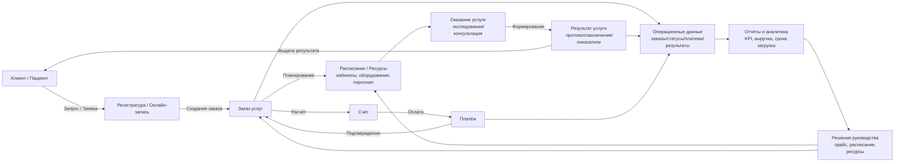
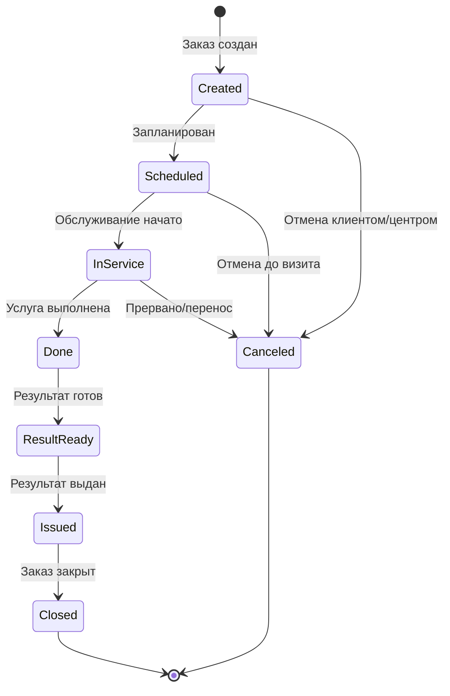
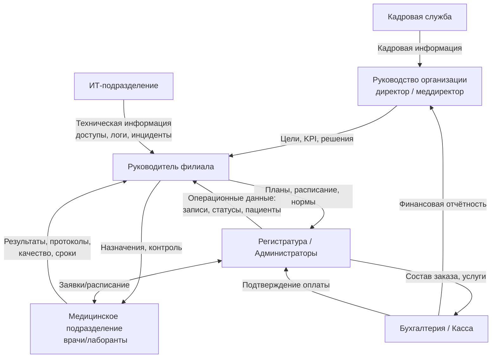
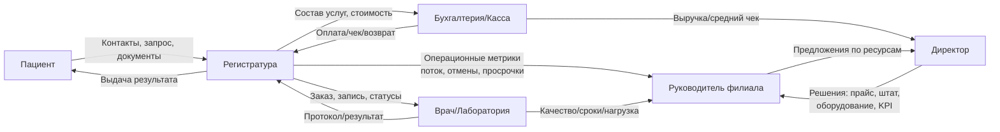

# Практика

 

## Этап 1. Анализ предментой области

---

# Что требуется выполнить в данном пункте 

В рамках Этапа 1 «Анализ предметной области» студент обязан:

1. Выбрать конкретную организацию.
2. Дать общую характеристику деятельности организации.
3. Определить сферу деятельности и тип клиентов.
4. Выделить основные направления работы (операционные, управленческие, вспомогательные).
5. Описать масштаб деятельности.
6. Определить ключевые продукты (услуги) и формируемые данные.
7. Представить деятельность как систему взаимосвязанных процессов.
8. Сформировать схематическое описание предметной области.
9. Выполнить анализ организационной структуры:

    * уровни управления;
    * основные подразделения;
    * функции подразделений;
    * информационные потоки между ними.

10. Построить схему организационной структуры.
11. Зафиксировать, какие данные формируются, передаются и используются для принятия решений.

Объём раздела должен быть достаточным для последующего проектирования информационной системы.

---

# Важно

Приведённое ниже описание сети диагностических центров является **примером выполнения анализа предметной области**.

Данный пример:

* демонстрирует структуру изложения;
* показывает уровень детализации;
* иллюстрирует способ логического связывания процессов, данных и организационной структуры;
* содержит примеры схем в формате Mermaid.

Студент обязан:

* выбрать собственную предметную область (в соответствии с темой практики);
* выполнить анализ по аналогичной структуре;
* сохранить логическую связность описания;
* отразить реальные или моделируемые бизнес-процессы;
* построить собственные схемы (а не копировать приведённый пример).
  
---

## Объект исследования: сеть диагностических центров «МедДиагностика+»

**Организация:** коммерческая сеть частных медицинских диагностических центров «МедДиагностика+» (3 филиала).

**Профиль:** лабораторные анализы, инструментальная диагностика (УЗИ/КТ/МРТ), консультации врачей, комплексные чек-апы.

**Цель исследования:** формализовать деятельность (процессы, роли, данные, информационные потоки) как основу для последующей автоматизации.

---

## 1.1. Анализ предметной области

### 1.1.1. Общая характеристика деятельности (контекст, участники, потоки)

«МедДиагностика+» оказывает медицинские услуги по обращению пациентов (B2C) и по договорам с организациями (B2B). Клиент (пациент или представитель компании) инициирует обращение: **звонок/сайт/стойка регистрации**. Далее организация должна:

1. идентифицировать клиента (создать/обновить карточку пациента);
2. сформировать **заявку/заказ услуг** (набор процедур и/или консультаций);
3. назначить ресурсы: время, кабинет, врача/лаборанта, оборудование;
4. оказать услугу (выполнить исследование/взять биоматериал/провести консультацию);
5. сформировать **медицинский результат** (заключение, протокол, показатели);
6. выполнить расчет стоимости, выставление счета, прием оплаты;
7. выдать результат и обеспечить хранение истории обращений;
8. сформировать отчёты для руководства (загрузка, выручка, качество, сроки, возвраты).

У организации присутствуют информационные потоки двух типов:

* **операционные**: запись, оказание услуги, результаты, оплаты, статусы, очереди;
* **управленческие**: отчёты по филиалам, выручке, популярности услуг, срокам готовности результатов, эффективности персонала.

Ключевая особенность предметной области — работа с **персональными и медицинскими данными**, что требует строгого разграничения доступа, неизменяемости результатов (аудит), и чёткой фиксации статусов в жизненном цикле заказа.

---

### 1.2.1. Сфера деятельности

Сфера деятельности — **медицинские услуги** (частная диагностика и консультации).
Это определяет:

* необходимость ведения **медицинской документации** (протоколы, заключения, результаты анализов);
* регламентируемые сроки и контроль качества (например, сроки готовности результатов);
* обязательность учета согласий/документов пациента;
* повышенные требования к безопасности данных (в т.ч. разграничение доступа по ролям: администратор ≠ врач ≠ бухгалтер).

---

### 1.3.1. Основные направления работы

Деятельность логически распадается на направления, каждое из которых порождает конкретные данные.

#### 1) Операционная деятельность (оказание услуг)

* регистрация пациента и создание/актуализация карточки;
* запись на приём/исследование;
* подготовка пациента (инструкции, ограничения, согласия);
* выполнение процедуры/исследования;
* формирование результата и выдача пациенту.

**Данные:** пациенты, заявки/заказы, расписание, услуги, статусы, результаты, исполнители, кабинеты, оборудование.

#### 2) Финансово-расчетная деятельность

* формирование стоимости заказа (прайс, скидки, пакеты);
* выставление счета;
* прием оплаты (нал/карта/онлайн);
* возвраты/корректировки.

**Данные:** счета, платежи, кассовые операции, скидки, договоры, акты.

#### 3) Управленческая деятельность (аналитика и контроль)

* мониторинг загрузки специалистов и оборудования;
* контроль сроков готовности результатов;
* анализ выручки и маржинальности по услугам;
* контроль качества: повторные обращения, жалобы, расхождения результатов.

**Данные:** агрегированные отчёты, KPI, статистика по филиалам и направлениям.

#### 4) Вспомогательные процессы

* кадровый учет;
* ИТ-сопровождение (доступы, инциденты, резервное копирование);
* закупки реагентов/расходников (для лаборатории).

**Данные:** сотрудники, роли, смены, заявки в ИТ, складские остатки.

---

### 1.4.1. Масштаб деятельности

**Средний масштаб**, влияющий на требования к ИС:

* 3 филиала, распределённая работа;
* 45 сотрудников (медперсонал + администрация + бухгалтерия + ИТ);
* 300–400 посещений/день;
* интенсивный поток заявок и статусов;
* высокая стоимость ошибки (неверные результаты/потеря данных/ошибка в оплате).

Следствие: нужна система с централизованным хранилищем, быстрым поиском по пациентам/заказам, устойчивостью к сбоям, журналированием изменений.

---

### 1.5.1. Тип клиентов

**B2C:** физические лица (пациенты).

* нужна карточка пациента, контакты, история обращений, согласия, результаты.

**B2B:** компании (корпоративные программы).

* нужны договоры, списки сотрудников, лимиты, акты, отчёты по медосмотрам.

Следствие для данных: два “входа” заказов — от физлица и от компании, но жизненный цикл услуги одинаковый (заказ → расписание → выполнение → результат → расчет).

---

### 1.6.1. Ключевые продукты и услуги

**Продукт (ценность)** — диагностический результат: анализ/протокол/заключение + сервис (сроки, удобство).
Основные услуги:

* лаборатория (анализы крови/мочи и др.);
* диагностика (УЗИ/КТ/МРТ/ЭКГ);
* консультации врачей;
* пакеты (чек-ап).

**Информационное ядро (ключевые сущности):**

* Пациент (идентификация, контакты, документы/согласия)
* Заявка/Заказ (набор услуг)
* Услуга (справочник услуг и прайс)
* Запись/Слот расписания (когда, где, кто)
* Исполнитель (врач/лаборант)
* Результат (показатели/заключение)
* Счет/Оплата
* Статусы и журнал изменений (аудит)

---

### 1.7.1. Акцент на процессы и данные (формализация)

Предметную область удобно представить как **две связанные петли**:

* **Операционная петля**: “клиент → обслуживание → результат”
* **Управленческая петля**: “данные → отчёты → решения → изменения в обслуживании”

#### Mermaid-схема: общий контур предметной области (аналог рисунка 1)

**Пояснение логики:**
Заявка порождает заказ. Заказ планируется в расписании с учетом ресурсов. После оказания услуги формируется результат, который возвращается клиенту. Параллельно формируются финансовые документы (счёт и оплата). Все события фиксируются в операционных данных, затем агрегируются в отчёты, по которым руководство принимает решения, влияющие на расписание и правила обслуживания.

---

## 1.1.2. Детализация ключевого процесса обслуживания (по шагам и данным)

Чтобы анализ был пригоден для проектирования ИС, фиксируем “сквозной процесс” с входами/выходами.

### Основной процесс: “Запись → Оказание услуги → Результат → Выдача”

**Шаг 1. Идентификация клиента**

* Вход: ФИО, телефон, дата рождения, документ (опционально), email
* Выход: карточка пациента (создана/обновлена), присвоен ID

**Шаг 2. Формирование заказа услуг**

* Вход: выбранные услуги/пакет, филиал, желаемая дата/время, тип клиента (B2C/B2B), договор (если B2B)
* Выход: заказ с составом услуг, предварительная стоимость, статус “Создан”

**Шаг 3. Планирование ресурсов**

* Вход: график специалистов, доступность кабинетов/оборудования, длительность услуг
* Выход: запись(и) в расписании, статус “Запланирован”

**Шаг 4. Оказание услуги**

* Вход: заказ, пациент, назначенный исполнитель, оборудование
* Выход: отметка выполнения, протокол процедуры, статус “Выполнен”

**Шаг 5. Формирование результата**

* Вход: измерения/показатели/заключение врача
* Выход: результат в системе, электронная подпись/утверждение, статус “Готов”

**Шаг 6. Выдача результата**

* Вход: готовый результат, канал выдачи (лично/почта/кабинет)
* Выход: отметка выдачи, статус “Выдан”

**Шаг 7. Закрытие финансов**

* Вход: расчет стоимости, скидки, оплата
* Выход: чек/платеж, статус “Оплачен” (или “Долг/Корректировка”)

---

## 1.1.3. Жизненный цикл заказа (статусы)

Для автоматизации важны статусы. Ниже — минимально достаточная цепочка.

**Почему это важно:** именно статусы позволяют строить отчёты (сколько отмен, сколько просроченных результатов), управлять очередями и выявлять узкие места.

---

# 1.2. Анализ организационной структуры

## 1.2.1. Уровни управления

### Стратегический уровень

**Генеральный директор сети**

* утверждает стратегию (открытие филиалов, ценовая политика, инвестиции в оборудование);
* утверждает KPI (выручка, качество, сроки, удовлетворенность).

### Тактический уровень

**Руководители филиалов / медицинский директор**

* формируют расписание, контролируют загрузку ресурсов;
* обеспечивают соблюдение стандартов качества;
* решают конфликты и нестандартные ситуации (перезаписи, претензии).

### Операционный уровень

**Администраторы, врачи, лаборанты, кассиры**

* выполняют ежедневные операции: регистрация, услуги, результаты, оплаты.

---

## 1.2.2. Основные подразделения

1. **Дирекция (управление сетью)**
2. **Медицинское подразделение** (врачи, лаборанты)
3. **Регистратура / клиентский сервис** (администраторы)
4. **Бухгалтерия / касса**
5. **Кадровая служба**
6. **ИТ-отдел**

---

## 1.2.3. Функции подразделений и их взаимодействие (что кому передают)

С точки зрения автоматизации фиксируем “кто является источником каких данных” и “кто потребитель”.

* Регистратура — источник данных по пациентам и записям; потребитель — расписание и статусы заказов.
* Медицинское подразделение — источник результатов; потребитель — список назначений и данные пациента.
* Бухгалтерия — источник финансовых документов; потребитель — состав заказа и применяемые тарифы.
* Дирекция — потребитель агрегированных отчётов; источник управленческих решений (прайс, нормы времени, графики).
* ИТ — источник технических данных (логи, доступы); потребитель — заявки/инциденты.
* Кадры — источник данных по персоналу; потребитель — графики, роль/доступ.

---

## 1.2.4. Роли и подразделения (обобщённая таблица)

| Подразделение / роль                        | Основные функции                       | Используемые и формируемые данные                      |
| ------------------------------------------- | -------------------------------------- | ------------------------------------------------------ |
| Руководство (директор, меддиректор)         | Стратегия, KPI, контроль качества      | Сводные отчёты, показатели, решения                    |
| Регистратура / администраторы               | Запись, создание заказов, коммуникации | Карточки пациентов, заявки, расписание, статусы        |
| Медицинское подразделение (врачи/лаборанты) | Оказание услуг, результаты             | Назначения, протоколы, заключения, результаты анализов |
| Бухгалтерия / касса                         | Счета, оплаты, возвраты                | Счета, платежи, чеки, акты, отчеты                     |
| Кадровая служба                             | Персонал, приказы, графики             | Сотрудники, должности, смены                           |
| ИТ-отдел                                    | Доступы, поддержка ИС                  | Роли доступа, журналы, инциденты, резервные копии      |

---

## 1.2.5. Схема организационной структуры (аналог рисунка 2)

**Пояснение:**
Руководство получает агрегированную информацию, принимает решения и транслирует планы через руководителя филиала. Регистратура и медподразделение постоянно обмениваются данными по расписанию и исполнению. Бухгалтерия замыкает финансовый контур и формирует отчётность. ИТ и кадры обеспечивают поддержку ресурсной части.

---

# 1.3. Информационные потоки (что “течёт” по системе)

Чтобы логически связать предметную область и оргструктуру, фиксируем основные потоки данных:

1. **Поток “Клиент → Регистратура”**
   Данные пациента + запрос на услугу → формирование заказа/записи.

2. **Поток “Регистратура → Медицинское подразделение”**
   Назначения и расписание → выполнение исследований.

3. **Поток “Медицинское подразделение → Регистратура/Пациент”**
   Результаты → выдача/уведомление.

4. **Поток “Заказ → Бухгалтерия”**
   Состав услуг → счет/оплата/возвраты → подтверждение оплаты.

5. **Поток “Операционные данные → Руководство”**
   Агрегированные отчёты → решения → корректировки расписания/прайса.

Ниже — Mermaid, связывающий подразделения именно потоками данных.

---

# 1.4. Вывод по этапу 1 (что зафиксировано и почему это “основа”)

По итогам этапа анализа предметной области и оргструктуры зафиксировано:

1. **Контекст**: сеть диагностических центров, B2C+B2B, медицинские данные.
2. **Ключевой сквозной процесс**: запись → услуга → результат → выдача → финансы.
3. **Информационное ядро**: пациент, заказ, услуга, расписание, результат, оплата, статусы, аудит.
4. **Оргструктура**: уровни управления и подразделения, источники данных и потребители.
5. **Информационные потоки**: кто формирует какие данные и кому они нужны для решений.

Это напрямую задаёт требования к будущей ИС: единые статусы, единые справочники услуг, централизованное расписание, журналирование изменений, разграничение доступа и управленческая аналитика.
 