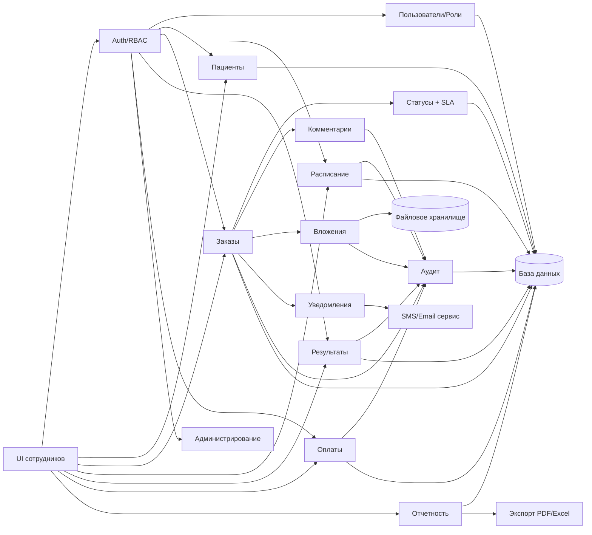

# Практика

 
## Этап 4. Проектирование решения

**Тема:** Информационная система автоматизации процесса записи пациента и обработки заказов услуг в сети диагностических центров «МедДиагностика+».

---

## Что требуется выполнить в данном пункте

В рамках Этапа 4 «Проектирование решения» студент обязан:

1. **Выбрать стратегию автоматизации** для выбранного процесса (из Этапа 2) и описать рассматриваемые варианты:

   * собственная разработка;
   * готовое решение;
   * облачный сервис;
   * комбинированный вариант.

2. Для **каждого варианта стратегии** (п. 4.1.1–4.1.4) указать:

   * краткое описание применительно к своей организации;
   * **плюсы** и **минусы** (не менее 4–5 пунктов каждого вида).

3. **Составить сравнительную таблицу вариантов** (как в п. 4.1.5), где сравнить минимум по критериям:

   * гибкость;
   * срок внедрения;
   * контроль над данными;
   * стоимость владения;
   * риски.

4. **Обосновать выбор оптимальной стратегии** (п. 4.1.6), указав:

   * почему выбранный подход лучше подходит к требованиям организации;
   * какие риски он снижает;
   * какие возможности расширения обеспечивает.

---

### Проектирование данных (4.2)

5. **Определить состав сущностей** для автоматизации процесса (не менее 8–12 сущностей), включая:

   * пользователей и роли;
   * клиента/контрагента;
   * основной объект процесса (заявка/заказ/запись и т.п.);
   * статусы;
   * историю изменений/аудит;
   * комментарии и вложения;
   * справочники (услуги/типы/каналы и т.п.);
   * (опционально) уведомления и финансовые сущности.

6. **Описать связи между сущностями** (1→N, N→M при необходимости) и объяснить их смысл в рамках процесса.

7. **Построить ER-диаграмму** в формате **Mermaid erDiagram**, включающую:

   * все основные сущности;
   * ключевые атрибуты;
   * PK/FK;
   * основные связи.

8. **Провести нормализацию модели данных до 3НФ**, описав:

   * какие повторяющиеся группы вынесены в отдельные таблицы (1НФ);
   * почему отсутствуют частичные зависимости (2НФ);
   * какие транзитивные зависимости устранены (3НФ).

9. **Составить описание структуры таблиц** (спецификацию) минимум для ключевых таблиц, указав:

   * имя таблицы;
   * поля (тип данных);
   * PK/FK/UQ (если применимо);
   * назначение (что хранит поле).

---

### Проектирование архитектуры системы (4.3)

10. **Определить архитектурные уровни системы**, минимум:

* UI (интерфейс);
* сервер приложений / API;
* база данных;
* интеграции (уведомления, экспорт, учетная система и т.п.).

11. **Описать взаимодействие компонентов** на сценарии (пример: создание заявки/заказа → назначение → смена статуса → фиксация результата), указав:

* какие запросы идут из UI в API;
* какие операции выполняются в БД;
* где формируется аудит;
* где вызываются внешние сервисы.

12. **Зафиксировать точки безопасности** по уровням:

* UI: HTTPS, защита токенов/сессий, базовые web-угрозы;
* API: аутентификация, RBAC, валидация, журналирование критичных операций;
* БД: права доступа, целостность, резервное копирование;
* интеграции: TLS, хранение ключей, минимизация передачи критичных данных.

13. **Построить архитектурную схему** в Mermaid (flowchart), показывающую:

* пользователей/клиентов;
* UI;
* API и ключевые сервисы (auth/audit/report);
* БД и файловое хранилище;
* внешние интеграции.

---

### Проектирование модулей системы (4.4)

14. **Выделить программные модули** (обычно 10–12) и перечислить их:

* RBAC/авторизация;
* пользователи и роли;
* клиенты;
* основной объект процесса (заявки/заказы);
* статусы/маршрутизация;
* комментарии;
* вложения;
* аудит/история изменений;
* отчётность;
* уведомления;
* администрирование/настройки;
* интеграции (опционально).

15. **Описать каждый модуль** в таблице:

* назначение;
* входные данные;
* выходные данные;
* связи с другими модулями.

16. **Построить схему взаимодействия модулей** (Mermaid), где видно:

* какие модули вызываются из UI;
* какие модули опираются на RBAC;
* как модуль основного процесса связан с аудитом, вложениями, уведомлениями;
* где используются БД и файловое хранилище.

17. **Сделать краткую трассировку** (примечание), что:

* модули покрывают функциональные требования Этапа 3;
* модули безопасности/аудита обеспечивают нефункциональные требования.

Объём раздела должен быть достаточным для перехода к реализации: подготовке DDL БД, проектированию API, макетов UI и плану разработки.

---

## Важно

Приведённый пример (для сети диагностических центров) является **образцом выполнения Этапа 4**.

Данный пример:

* демонстрирует структуру изложения раздела 4 (стратегия → данные → архитектура → модули);
* показывает, как обосновывать стратегию автоматизации и связывать её с требованиями;
* иллюстрирует, какие сущности и связи должны быть отражены в ER-модели;
* содержит примеры Mermaid-схем (ER, архитектура, взаимодействие модулей).

Студент обязан:

* выполнить Этап 4 для **своей предметной области** и выбранного процесса;
* сохранить структуру подпунктов 4.1–4.4;
* спроектировать **свою** модель данных (сущности, связи, нормализация), а не копировать пример;
* построить **свои** схемы (ER, архитектура, модули), отражающие участников и данные своего кейса;
* обосновать решения с учетом требований безопасности, масштабируемости и эксплуатации.


---

## 4.1. Выбор стратегии автоматизации

Выбор стратегии автоматизации определяет, **как именно будет создана и внедрена система**: собственная разработка, готовое решение, облачный сервис или комбинированный вариант. Для медицинской предметной области критично учитывать:

* требования к защите персональных и медицинских данных;
* необходимость точного контроля статусов и сроков;
* возможность интеграции с кассой/бухгалтерией и сервисами уведомлений;
* масштабирование на несколько филиалов.

---

### 4.1.1. Собственная разработка

**Описание варианта (для клиники)**
Система разрабатывается с нуля под процессы клиники: карточка пациента, запись, заказ услуг, результаты, платежи, отчеты, аудит.

**Плюсы:**

* максимальная адаптация под логику клиники (слоты, длительность процедур, кабинеты, оборудование);
* контроль над хранением медицинских данных (локально/в частном контуре);
* точная реализация RBAC и журналирования (аудит медицинских данных);
* поэтапное развитие (добавление лаборатории, интеграции, чек-ап пакеты).

**Минусы:**

* высокие сроки и стоимость разработки;
* необходимость команды (аналитик, backend, frontend, DevOps, тестирование);
* ответственность за поддержку 24/7 и обновления безопасности.

---

### 4.1.2. Готовое решение

**Описание варианта (для клиники)**
Использование CRM/ServiceDesk/системы учета клиентов и заявок, адаптированной под запись и статусы.

**Плюсы:**

* быстрый старт (можно начать с регистрации заказов);
* базовый функционал из коробки (клиенты, задачи, статусы).

**Минусы:**

* медицинские процессы (врачебные заключения, протоколы, ограничение доступа к медданным) часто плохо ложатся;
* сложно “натянуть” расписание по кабинетам/оборудованию;
* интеграции и доработки дороже и зависят от поставщика.

---

### 4.1.3. Облачный сервис (SaaS)

**Описание варианта (для клиники)**
Использование облачной системы записи/заказов с web-доступом.

**Плюсы:**

* быстрый запуск (дни/недели);
* обновления и бэкапы на стороне провайдера;
* масштабирование пользователей.

**Минусы:**

* зависимость от интернета;
* риски хранения медицинских данных у внешнего провайдера;
* ограничение в кастомизации под филиальную модель и аудит.

---

### 4.1.4. Комбинированный вариант

**Описание варианта (рекомендуемый для клиники)**
Критичные данные и ядро (пациент, заказ, результаты, аудит) — **внутри организации**.
Внешние сервисы — **по необходимости**: уведомления (SMS/email), экспорт отчетов, интеграция с учетной системой.

**Плюсы:**

* контроль над медданными и критичными операциями;
* быстрый старт за счет готовых компонентов (уведомления/экспорт);
* гибкость в развитии и добавлении интеграций;
* снижение риска vendor lock-in (ядро остаётся у организации).

**Минусы:**

* архитектура усложняется (интеграции, очереди, секреты);
* требуется аккуратное проектирование и сопровождение.

---

### 4.1.5. Сравнительная таблица вариантов

| Вариант                | Гибкость       | Срок внедрения | Контроль над данными | Стоимость владения | Риски          |
| ---------------------- | -------------- | -------------- | -------------------- | ------------------ | -------------- |
| Собственная разработка | Высокая        | Длительный     | Полный               | Высокая            | Средние        |
| Готовое решение        | Средняя        | Короткий       | Ограниченный         | Средняя            | Низкие–средние |
| Облачный сервис        | Низкая–средняя | Очень короткий | Низкий               | Средняя            | Средние        |
| Комбинированный        | Высокая        | Средний        | Высокий              | Средняя            | Средние        |

---

### 4.1.6. Выбор оптимальной стратегии

Для «МедДиагностика+» оптимальна **комбинированная стратегия**, потому что:

* медицинские данные требуют **контроля хранения, RBAC и аудита**;
* ядро процесса (заказ/статусы/результат) должно быть полностью управляемым;
* уведомления (SMS/email) и экспорт (PDF/Excel) удобно вынести во внешние компоненты;
* систему нужно масштабировать на 3 филиала без потери управляемости.

---

---

## 4.2. Проектирование данных

Проектирование данных выполняется под автоматизируемый процесс: **запись пациента и обработка заказа услуг**. В отличие от “универсальных заявок”, в клинике появляются сущности: **запись/слот**, **филиал**, **кабинет**, **услуга**, **медицинский результат**.

---

### 4.2.1. Сущности и связи (адаптация под клинику)

**Базовые сущности:**

* **USER** — сотрудник системы;
* **ROLE** — роль доступа;
* **PATIENT** — пациент (B2C) или представитель (в расширении);
* **ORGANIZATION** — корпоративный клиент (B2B, опционально);
* **SERVICE** — услуга/процедура;
* **ORDER** — заказ услуг (аналог REQUEST);
* **ORDER_ITEM** — состав заказа (несколько услуг в одном заказе);
* **APPOINTMENT** — запись в расписании (дата/время/кабинет/врач);
* **ROOM** — кабинет;
* **BRANCH** — филиал;
* **ORDER_STATUS** — статусы заказа;
* **RESULT** — результат/заключение (для услуги/заказа);
* **COMMENT**, **ATTACHMENT**, **HISTORY** — коммуникации/файлы/аудит;
* **PAYMENT** — платежи/финансовые данные (минимально).

**Ключевые связи:**

* ROLE 1→N USER
* PATIENT 1→N ORDER
* ORDER 1→N ORDER_ITEM
* SERVICE 1→N ORDER_ITEM
* ORDER 1→N APPOINTMENT
* USER(doctor) 1→N APPOINTMENT
* BRANCH 1→N ROOM, 1→N USER (опционально), 1→N APPOINTMENT
* ORDER_STATUS 1→N ORDER
* ORDER 1→N RESULT / или ORDER_ITEM 1→N RESULT (точнее)
* ORDER 1→N COMMENT / ATTACHMENT / HISTORY
* ORDER 1→N PAYMENT

---

### 4.2.2. ER-диаграмма (Mermaid) — клиническая версия

```mermaid
erDiagram
    ROLE ||--o{ USER : "назначает"
    BRANCH ||--o{ ROOM : "имеет"
    BRANCH ||--o{ APPOINTMENT : "проводит"
    PATIENT ||--o{ ORDER : "создает"
    ORDER_STATUS ||--o{ ORDER : "имеет"
    ORDER ||--o{ ORDER_ITEM : "содержит"
    SERVICE ||--o{ ORDER_ITEM : "входит"
    USER ||--o{ APPOINTMENT : "врач"
    ROOM ||--o{ APPOINTMENT : "кабинет"
    ORDER ||--o{ APPOINTMENT : "планируется"
    ORDER_ITEM ||--o{ RESULT : "результат"
    ORDER ||--o{ ORDER_COMMENT : "комментируется"
    ORDER ||--o{ ORDER_ATTACHMENT : "вложения"
    ORDER ||--o{ ORDER_HISTORY : "аудит"
    ORDER ||--o{ PAYMENT : "оплата"

    ROLE {
      int role_id PK
      string name
      string description
    }

    USER {
      int user_id PK
      int role_id FK
      int branch_id FK
      string login UQ
      string password_hash
      string full_name
      string email
      bool is_active
      datetime created_at
    }

    BRANCH {
      int branch_id PK
      string name
      string address
      string phone
      bool is_active
    }

    ROOM {
      int room_id PK
      int branch_id FK
      string name
      string room_type "uZi|lab|consult|mri|ct"
      bool is_active
    }

    PATIENT {
      int patient_id PK
      string full_name
      date birth_date
      string phone
      string email
      string document_id
      datetime created_at
    }

    ORDER_STATUS {
      int status_id PK
      string name UQ
      int sort_order
      bool is_final
    }

    SERVICE {
      int service_id PK
      string name
      int duration_min
      decimal price
      bool is_active
    }

    ORDER {
      int order_id PK
      int patient_id FK
      int status_id FK
      int created_by_user_id FK
      int branch_id FK
      string channel "phone|site|desk"
      int priority
      datetime created_at
      datetime due_at
      datetime closed_at
    }

    ORDER_ITEM {
      int item_id PK
      int order_id FK
      int service_id FK
      int assigned_doctor_user_id FK
      decimal price_snapshot
      string item_status "planned|done|canceled"
    }

    APPOINTMENT {
      int appointment_id PK
      int order_id FK
      int room_id FK
      int doctor_user_id FK
      datetime start_at
      datetime end_at
      string status "scheduled|arrived|in_service|done|no_show|canceled"
    }

    RESULT {
      int result_id PK
      int item_id FK
      int author_user_id FK
      string result_type "protocol|lab|conclusion"
      text payload_text
      datetime created_at
      datetime signed_at
    }

    PAYMENT {
      int payment_id PK
      int order_id FK
      decimal amount
      string method "cash|card|online"
      string status "pending|paid|refunded|failed"
      datetime paid_at
    }

    ORDER_COMMENT {
      int comment_id PK
      int order_id FK
      int author_user_id FK
      text text
      datetime created_at
    }

    ORDER_ATTACHMENT {
      int attachment_id PK
      int order_id FK
      int uploaded_by_user_id FK
      string file_name
      string file_path
      int file_size
      datetime created_at
    }

    ORDER_HISTORY {
      int history_id PK
      int order_id FK
      int changed_by_user_id FK
      string change_type
      string old_value
      string new_value
      datetime created_at
    }
```

///caption
Рисунок 7 – ER-диаграмма данных ИС «МедДиагностика+»
///

---

### 4.2.3. Нормализация до 3НФ (на примере клиники)

**1НФ:**

* все атрибуты атомарны (телефон — отдельное поле, состав заказа не хранится “списком” в ORDER → вынесен в ORDER_ITEM);
* повторяющиеся группы вынесены в отдельные таблицы: комментарии, вложения, история, платежи.

**2НФ:**

* отсутствуют частичные зависимости от составного ключа, т.к. ключи в сущностях — суррогатные (ID);
* состав заказа (ORDER_ITEM) имеет собственный PK и зависит от order_id полностью.

**3НФ:**

* справочники вынесены отдельно: ROLE, ORDER_STATUS, SERVICE, BRANCH, ROOM;
* цены в заказе фиксируются снимком (price_snapshot) — это проектное решение для корректности финансовой истории;
* результаты вынесены в RESULT, не дублируются в ORDER.

---

### 4.2.4. Описание структуры таблиц (краткая спецификация)

Чтобы не перегружать, ниже — “ядро” (главные таблицы для процесса). Остальные — по вашему шаблону аналогично.

#### ORDER (Заказ услуг)

| Поле               | Тип       | Ключ | Назначение           |
| ------------------ | --------- | ---- | -------------------- |
| order_id           | INT       | PK   | Идентификатор заказа |
| patient_id         | INT       | FK   | Пациент              |
| status_id          | INT       | FK   | Статус заказа        |
| created_by_user_id | INT       | FK   | Кто создал           |
| branch_id          | INT       | FK   | Филиал               |
| channel            | VARCHAR   |      | Канал поступления    |
| priority           | INT       |      | Приоритет            |
| created_at         | TIMESTAMP |      | Создан               |
| due_at             | TIMESTAMP |      | Срок (SLA)           |
| closed_at          | TIMESTAMP |      | Закрыт               |

#### ORDER_ITEM (Позиции заказа)

| Поле                    | Тип     | Ключ | Назначение            |
| ----------------------- | ------- | ---- | --------------------- |
| item_id                 | INT     | PK   | Идентификатор позиции |
| order_id                | INT     | FK   | Ссылка на заказ       |
| service_id              | INT     | FK   | Услуга                |
| assigned_doctor_user_id | INT     | FK   | Назначенный врач      |
| price_snapshot          | DECIMAL |      | Цена на момент заказа |
| item_status             | VARCHAR |      | Статус позиции        |

#### APPOINTMENT (Запись)

| Поле           | Тип      | Ключ | Назначение           |
| -------------- | -------- | ---- | -------------------- |
| appointment_id | INT      | PK   | Идентификатор записи |
| order_id       | INT      | FK   | Заказ                |
| room_id        | INT      | FK   | Кабинет              |
| doctor_user_id | INT      | FK   | Врач                 |
| start_at       | DATETIME |      | Начало               |
| end_at         | DATETIME |      | Конец                |
| status         | VARCHAR  |      | Статус визита        |

---

---

## 4.3. Проектирование архитектуры системы

Архитектура строится по принципу: **UI → API → БД + интеграции**, с акцентом на безопасность и аудит медицинских данных.

---

### 4.3.1. Уровни системы (для клиники)

1. **Уровень представления (UI):**

* веб-панель для сотрудников (администратор, врач, касса, руководитель);
* опционально: публичная форма пациента (запрос/запись/проверка статуса).

2. **Прикладной уровень (API):**

* бизнес-логика заказов, расписания, статусов, результатов;
* RBAC, аудит, SLA, уведомления, отчеты.

3. **Уровень данных (БД):**

* хранение пациентов, заказов, записей, результатов, платежей;
* PK/FK, транзакции, ограничения, резервное копирование.

4. **Интеграции:**

* SMS/e-mail уведомления;
* экспорт PDF/Excel;
* интеграция с бухгалтерией (опционально);
* файловое хранилище вложений.

---

### 4.3.2. Взаимодействие компонентов (типовой сценарий)

**Сценарий: запись пациента и создание заказа**

1. Администратор входит в систему (UI) → получает токен.
2. Создает/находит пациента → сохраняет данные.
3. Формирует заказ: выбирает услуги, филиал → система рассчитывает стоимость.
4. Выбирает слот в расписании → система создает APPOINTMENT и назначает врача/кабинет.
5. Система создает аудит-события (ORDER_HISTORY) и отправляет уведомление пациенту (SMS/email).
6. Врач видит свою загрузку, по визиту формирует RESULT.
7. Касса фиксирует PAYMENT и закрывает заказ.

---

### 4.3.3. Точки безопасности (медицинский контекст)

**UI:**

* HTTPS обязательно;
* защита токенов (httpOnly cookie или secure storage);
* ограничение интерфейса по роли (что видно и что доступно).

**API:**

* JWT/сессии + RBAC;
* строгая валидация данных;
* аудит: запись “кто и когда смотрел/менял результат” (для медданных критично);
* rate limiting (если есть публичная форма).

**DB:**

* отдельные учетные записи (минимальные привилегии);
* контроль целостности и транзакции;
* резервные копии и тест восстановления.

**Интеграции:**

* TLS;
* хранение ключей в защищённой конфигурации;
* минимизация ПДн в уведомлениях (не отправлять диагнозы/результаты в тексте SMS).

---

### 4.3.4. Архитектурная схема системы (Mermaid) — клиника

```mermaid
flowchart TB
  subgraph USERS[Пользователи]
    A[Администратор]
    D[Врач/Лаборант]
    K[Касса/Бухгалтерия]
    M[Руководитель]
    P[Пациент\n(опционально)]
  end

  subgraph UI[Уровень представления]
    WEB[Веб-интерфейс сотрудников]
    PUB[Публичная форма пациента\n(опционально)]
  end

  subgraph API[Сервер приложений]
    GATE[API Gateway / Backend]
    AUTH[Auth + RBAC]
    ORD[Модуль заказов и позиций]
    SCH[Модуль расписания (слоты/кабинеты)]
    RES[Модуль результатов]
    PAY[Модуль оплат]
    REP[Модуль отчетности]
    AUD[Аудит и журналирование]
  end

  subgraph DATA[Уровень данных]
    DB[(База данных\nPatients/Orders/Appointments/Results/Payments)]
    FS[(Файловое хранилище\nВложения)]
  end

  subgraph EXT[Интеграции]
    NOTIF[Сервис уведомлений\nSMS/Email]
    EXP[Экспорт PDF/Excel]
    ACC[Учетная система\n(опционально)]
  end

  A --> WEB
  D --> WEB
  K --> WEB
  M --> WEB
  P --> PUB

  WEB -->|HTTPS| GATE
  PUB -->|HTTPS| GATE

  GATE --> AUTH
  GATE --> ORD
  GATE --> SCH
  GATE --> RES
  GATE --> PAY
  GATE --> REP
  GATE --> AUD

  ORD --> DB
  SCH --> DB
  RES --> DB
  PAY --> DB
  REP --> DB
  AUD --> DB
  GATE --> FS

  GATE -->|TLS| NOTIF
  REP --> EXP
  PAY --> ACC

  S1{{"HTTPS + токены"}}
  S2{{"RBAC + аудит медданных"}}
  S3{{"PK/FK + backup + restore"}}
  S4{{"TLS + секреты API"}}

  WEB --- S1
  AUTH --- S2
  DB --- S3
  NOTIF --- S4
```

///caption
Рисунок 8 – Архитектурная схема ИС «МедДиагностика+»
///

---

---

## 4.4. Проектирование модулей системы

Модули проектируются так, чтобы покрыть требования Этапа 3 и обеспечить управляемую разработку.

---

### 4.4.1. Перечень программных модулей (для клиники)

1. Аутентификация и авторизация (RBAC)
2. Управление пользователями и ролями
3. Управление пациентами (карточки, поиск, дубль-контроль)
4. Управление заказами (создание заказа, состав услуг)
5. Управление расписанием (слоты, кабинеты, врачи)
6. Управление статусами (заказ/визит/позиции) и SLA
7. Результаты и протоколы (врачебные заключения, подпись)
8. Комментарии и внутренние коммуникации
9. Вложения и файловое хранилище
10. Оплаты и финансовые документы (минимально)
11. Аудит и журналирование (в т.ч. доступ к медданным)
12. Отчетность и аналитика (загрузка, сроки, выручка)
13. Уведомления (SMS/email)
14. Администрирование и настройки (справочники: услуги, филиалы, кабинеты)

---

### 4.4.2. Описание модулей (назначение, вход/выход, связи)

| Модуль            | Назначение                          | Входные данные                | Выходные данные              | Связи                       |
| ----------------- | ----------------------------------- | ----------------------------- | ---------------------------- | --------------------------- |
| Auth + RBAC       | Вход, токены, проверки прав         | логин/пароль, токен           | токен, результат авторизации | UI, все модули              |
| Пользователи/роли | учет сотрудников, назначение ролей  | данные сотрудника, роль       | карточка сотрудника          | RBAC, БД, аудит             |
| Пациенты          | карточка пациента, поиск, антидубли | ФИО, контакты, дата рождения  | patient_id, карточка         | Заказы, аудит               |
| Заказы            | создание/редактирование заказа      | пациент, услуги, канал, сроки | order_id, состав             | Статусы, оплаты, расписание |
| Расписание        | слоты, кабинеты, назначение врача   | филиал, кабинет, врач, время  | appointment_id               | Заказы, аудит               |
| Статусы + SLA     | регламент переходов, просрочки      | текущий статус, правило       | новый статус, флаги SLA      | Заказы, отчеты              |
| Результаты        | протоколы/заключения/подпись        | текст/показатели, автор       | result_id, статус “готов”    | Заказы, аудит               |
| Комментарии       | коммуникации по заказу              | текст, автор                  | лента комментариев           | Заказы, аудит               |
| Вложения          | загрузка/доступ к файлам            | файл, метаданные              | attachment_id                | Хранилище, RBAC             |
| Оплаты            | фиксация платежей/возвратов         | сумма, способ, статус         | payment_id, чек              | Заказы, отчетность          |
| Аудит             | журнал действий и доступа           | события модулей               | записи истории               | Все модули                  |
| Отчетность        | отчеты KPI                          | период, фильтры               | отчет, выгрузка              | БД, экспорт                 |
| Уведомления       | SMS/email по событиям               | событие, шаблон               | статус отправки              | Заказы, аудит               |
| Администрирование | справочники и настройки             | услуги, кабинеты, SLA         | актуальные справочники       | все модули                  |

---

### 4.4.3. Взаимодействие модулей (Mermaid) — клиника



///caption
Рисунок 9 – Взаимодействие модулей ИС «МедДиагностика+»
///

---

### 4.4.4. Примечание по трассировке требований (как в методичке)

* Модули **Пациенты / Заказы / Расписание / Результаты / Оплаты / Статусы** напрямую реализуют функциональные требования (создание, поиск, статусы, результат, контроль сроков).
* Модули **RBAC / Аудит / Администрирование / Уведомления** обеспечивают нефункциональные требования по безопасности, надежности и совместимости.
* Модуль **Отчетность** обеспечивает управленческий контур (KPI, загрузка, сроки, выручка).

---
 