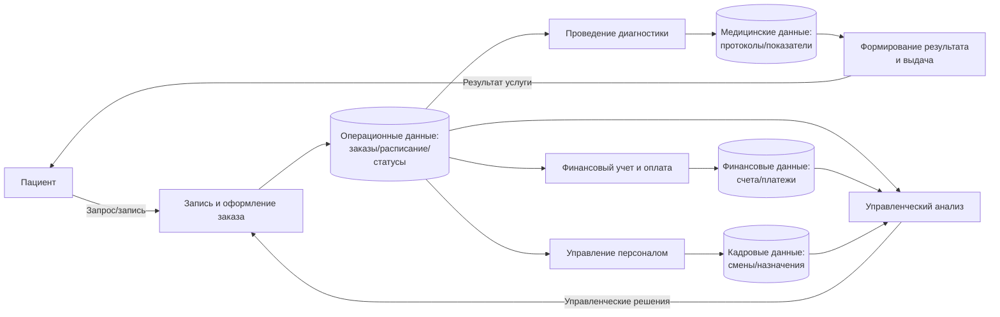
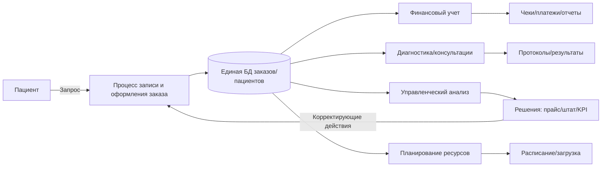
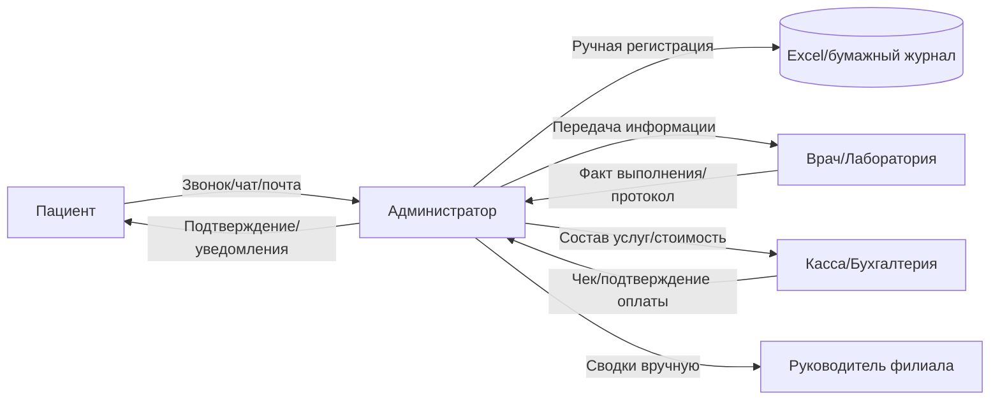
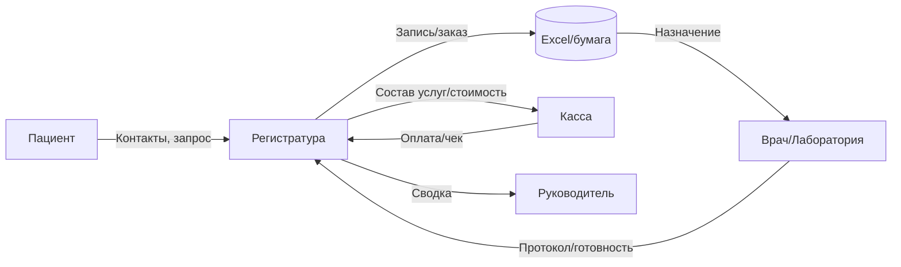

# Практика

---

## Этап 2. Анализ процессов и выбор автоматизации

**Пример (для сети диагностических центров «МедДиагностика+»)**

---

## Что требуется выполнить в данном пункте  

В рамках Этапа 2 «Анализ процессов и выбор автоматизации» студент обязан:

1. **Выделить ключевые процессы организации** и описать их с позиции процессного подхода (входы → преобразование → выходы).
2. **Классифицировать процессы** на:

   * основные;
   * вспомогательные;
   * управляющие.
3. **Составить таблицу ключевых процессов** (не менее 5), указав для каждого:

   * тип процесса;
   * входы;
   * выходы;
   * ответственных (подразделения/роли);
   * значимость (высокая/средняя/низкая).
4. **Построить схему взаимосвязи процессов** (Mermaid-диаграмма), показывающую:

   * запуск основного процесса клиентом;
   * формирование операционных данных;
   * использование данных вспомогательными процессами;
   * формирование управленческих решений и обратную связь.
5. **Выбрать один процесс для автоматизации** (приоритетный объект автоматизации).
6. **Обосновать выбор процесса** по критериям (минимум 4):

   * трудоёмкость;
   * вероятность ошибок;
   * объёмы данных;
   * влияние на результат деятельности;
   * (дополнительно можно: критичность сроков, межподразделенческая зависимость).
7. **Определить цели автоматизации** выбранного процесса (конкретные измеримые эффекты: сроки, ошибки, прозрачность, отчётность).
8. **Описать место процесса в системе деятельности организации**:

   * какие данные он формирует;
   * кто использует результаты;
   * как он влияет на другие процессы.
9. **Построить схему места процесса в системе** (Mermaid-диаграмма), где выбранный процесс связан с БД и смежными процессами.
10. **Описать текущее выполнение процесса (AS-IS)**:

    * общая характеристика текущего состояния;
    * последовательность шагов (8–12 шагов);
    * участники и роли (таблица);
    * документы и данные процесса;
    * проблемы и узкие места.
11. **Смоделировать текущий процесс (AS-IS)** в виде диаграммы (Mermaid flowchart/BPMN-приближение), отражающей участников и передачу работ/данных.
12. **Выполнить анализ информационных потоков процесса**:

    * определить источники и получателей данных;
    * описать типы данных (справочные/операционные/финансовые/отчётные и др.);
    * указать форматы хранения/передачи (Excel, почта, бумага и т.п.);
    * выявить проблемы и риски потоков;
    * указать возможности автоматизации.
13. **Составить таблицу информационных потоков** (источник → получатель → тип данных → формат → проблемы/риски → автоматизация).
14. **Построить схему информационных потоков AS-IS** (Mermaid-диаграмма).
15. **Определить требования безопасности** для автоматизируемого процесса:

    * категории информации и уровень критичности;
    * перечень угроз;
    * требования к доступу (RBAC, принцип минимальных привилегий);
    * требования к хранению и передаче данных;
    * требования к журналированию и аудиту.
16. **Составить сводную таблицу требований безопасности** (объект защиты → угрозы → меры/требования).

Объём раздела должен быть достаточным для перехода к проектированию: постановке требований к ИС, моделированию TO-BE и разработке структуры данных.

---

## Важно

Приведённый пример (для сети диагностических центров) является **образцом выполнения Этапа 2**.

Данный пример:

* демонстрирует структуру изложения раздела 2;
* показывает, как связывать процессы, данные, роли и выбранный объект автоматизации;
* иллюстрирует, какие таблицы и схемы должны присутствовать;
* содержит примеры диаграмм в формате Mermaid (взаимосвязь процессов, AS-IS, потоки, место процесса).

Студент обязан:

* выполнить Этап 2 для **своей предметной области** (в соответствии с темой практики);
* сохранить структуру подпунктов 2.1–2.5;
* описать **реальные или моделируемые процессы** именно своей организации;
* подготовить **свои таблицы** (процессы, потоки, безопасность), а не копировать пример;
* построить **свои схемы**, отражающие участников и данные именно своего кейса.

---

## 2.1. Описание ключевых процессов

Процессный анализ выполняется для того, чтобы представить деятельность организации как систему взаимосвязанных процессов, в которых **входные данные** преобразуются в **результаты**, создающие ценность клиенту и обеспечивающие выполнение целей организации. На этом этапе выделяются **основные**, **вспомогательные** и **управляющие** процессы, описываются их входы/выходы и взаимодействия.

---

### 2.1.1. Классификация процессов (для «МедДиагностика+»)

**Основные процессы** (создают ценность пациенту напрямую):

* запись пациента и формирование заказа услуг;
* проведение диагностики/взятие биоматериала;
* формирование и выдача результата (заключение/протокол/анализ).

**Вспомогательные процессы** (обеспечивают основные ресурсами и инфраструктурой):

* финансовый учет и кассовые операции;
* управление персоналом и графиками;
* управление оборудованием и расходниками (для лаборатории);
* ИТ-поддержка (доступы, инциденты, резервное копирование).

**Управляющие процессы** (планирование, анализ, контроль):

* мониторинг загрузки филиалов/врачей/оборудования;
* контроль сроков готовности результатов;
* анализ выручки и эффективности услуг;
* контроль качества (жалобы, повторные обращения, ошибки).

---

### 2.1.2. Характеристика ключевых процессов (пример таблицы)

| Процесс                                      | Тип процесса    | Входы                                                                                    | Выходы                                              | Ответственные                        | Значимость |
| -------------------------------------------- | --------------- | ---------------------------------------------------------------------------------------- | --------------------------------------------------- | ------------------------------------ | ---------- |
| Запись пациента и оформление заказа услуг    | Основной        | Запрос пациента, данные пациента, выбранные услуги, филиал, желаемое время               | Заказ услуг, запись в расписании, статус заказа     | Администраторы, руководитель филиала | Высокая    |
| Проведение диагностики / взятие биоматериала | Основной        | Запланированный заказ, назначение, медданные пациента, доступность кабинета/оборудования | Протокол процедуры, отметка выполнения              | Врач/лаборант                        | Высокая    |
| Формирование результата и выдача пациенту    | Основной        | Протокол, показатели анализов, заключение врача                                          | Результат (заключение/анализ), выдача/уведомление   | Врач, администратор                  | Высокая    |
| Финансовый учет и оплата                     | Вспомогательный | Состав заказа, прайс, скидки, договор                                                    | Счет, чек/платеж, закрытие оплаты                   | Кассир/бухгалтер                     | Высокая    |
| Управление персоналом (графики, смены)       | Вспомогательный | Данные сотрудников, приказы, план загрузки                                               | Графики, назначение смен                            | HR, руководитель филиала             | Средняя    |
| ИТ-поддержка (учет инцидентов)               | Вспомогательный | Запросы пользователей, ошибки системы, логи                                              | Решение инцидента, восстановление работоспособности | ИТ-специалист                        | Средняя    |
| Управленческий анализ и контроль KPI         | Управляющий     | Операционные данные (заказы, статусы), финансовые данные                                 | Отчеты, решения (прайс, расписание, ресурсы)        | Директор, руководители филиалов      | Высокая    |

---

### 2.1.3. Взаимосвязь ключевых процессов (Mermaid)

///caption
Рисунок 3 – Взаимосвязь ключевых процессов деятельности
///

**Пояснение:** основной контур (запись→диагностика→результат) создаёт ценность пациенту; вспомогательные процессы используют операционные данные; управляющий процесс замыкает цикл через решения (прайс, расписание, ресурсы).

---

## 2.2. Выбор процесса для автоматизации

В медицинской организации автоматизация может затрагивать разные области (расписание, результаты, финансы), однако наиболее критичным обычно является **сквозной процесс, который генерирует первичные данные** и вовлекает несколько подразделений.

---

### 2.2.1. Обоснование выбора процесса

Для автоматизации выбран **процесс записи пациента и обработки заказа услуг (регистрация → планирование → контроль статусов)**.

Почему именно он:

* это точка входа всех обращений;
* из него “рождаются” данные для диагностики, результатов и финансов;
* процесс проходит через регистратуру, врачей, кассу, руководство (много участников);
* при ручной обработке чаще всего возникают потери заявок, путаница расписания, ошибки в данных пациента.

---

### 2.2.2. Критерии выбора процесса

* **Высокая трудоёмкость:** запись и согласование времени ведутся вручную, часто с переносами; требуется постоянная коммуникация.
* **Вероятность ошибок:** ФИО/контакты/услуги/время/филиал часто фиксируются в разных местах.
* **Большие объёмы данных:** ежедневно сотни записей, статусы, перенесенные визиты, связанные оплаты.
* **Существенное влияние на результат:** скорость и корректность записи напрямую влияют на загрузку и удовлетворенность пациента.

---

### 2.2.3. Цели автоматизации процесса

* сократить время создания заказа и записи в расписание;
* исключить дубли карточек пациентов;
* обеспечить контроль статусов и сроков (запланирован/выполнен/результат готов);
* обеспечить единый источник данных для кассы и врачей;
* сформировать отчётность по загрузке и отказам автоматически.

---

### 2.2.4. Место процесса в общей системе деятельности

Процесс записи и оформления заказа — **центральный**: он связывает внешнюю среду (пациент) с внутренними подразделениями, создаёт первичные операционные данные и формирует основу для финансов и управленческого анализа.

---

### 2.2.5. Место процесса в системе (Mermaid)

///caption
Рисунок 4 – Место процесса записи и оформления заказа в системе деятельности организации
///

---

## 2.3. Описание текущего выполнения процесса

### 2.3.1. Общая характеристика процесса (AS-IS)

В текущем состоянии запись и обработка заказов выполняются через разрозненные каналы: звонки, мессенджеры, электронная почта, а фиксация ведётся в Excel и бумажных журналах. Из-за отсутствия единой системы возникает несогласованность данных между регистратурой, врачами и кассой, усложняется контроль статусов и сроков.

---

### 2.3.2. Последовательность шагов процесса (AS-IS)

1. Пациент обращается: телефон/мессенджер/почта/стойка.
2. Администратор вручную уточняет данные пациента и услуги.
3. Администратор ищет время по расписанию (часто отдельные таблицы по врачам).
4. Запись фиксируется в Excel/журнале.
5. Пациенту отправляется подтверждение вручную (сообщение/звонок).
6. В день визита врач получает список записей (распечатка/таблица/устно).
7. После услуги врач/администратор фиксирует факт выполнения и готовность результата (часто отдельно).
8. Касса формирует оплату по прайсу (иногда вручную сверяя состав услуг).
9. По итогам дня руководитель собирает сводки (часть данных из Excel, часть — из кассы).

---

### 2.3.3. Участники процесса и роли (пример)

| Участник                   | Роль в процессе                                                   |
| -------------------------- | ----------------------------------------------------------------- |
| Пациент                    | Инициатор, источник исходных данных                               |
| Администратор регистратуры | Прием обращения, регистрация пациента, запись и контроль статусов |
| Врач/лаборант              | Исполнитель услуги, формирование медицинских данных               |
| Кассир/бухгалтер           | Расчет стоимости, оплата, финансовые документы                    |
| Руководитель филиала       | Контроль загрузки, сроков, качества и отчетность                  |

---

### 2.3.4. Документы и данные процесса (AS-IS)

* обращение пациента (звонок/чат/письмо);
* журнал записей (Excel/бумага);
* карточка пациента (часто дублируется);
* прайс/лист услуг (файл/распечатка);
* протокол/результат исследования;
* счет/чек/платеж.

---

### 2.3.5. Проблемы и узкие места (AS-IS)

* дубли карточек пациентов (разные написания ФИО/телефона);
* ошибки записи (не тот врач/не то время/не та услуга);
* отсутствие единого статуса заказа (выполнено? результат готов? выдан?);
* сложность контроля сроков готовности результатов;
* несогласованность состава услуг между регистратурой и кассой;
* высокая зависимость от “опытного администратора” и ручного контроля.

---

### 2.3.6. Модель текущего процесса (AS-IS, Mermaid)

///caption
Рисунок 5 – Модель текущего выполнения процесса (AS-IS)
///

---

## 2.4. Анализ информационных потоков процесса

### 2.4.1. Источники и получатели данных

* **внешний источник:** пациент (контакты, запрос, предпочтения времени);
* **внутренние источники:** регистратура (заказы и записи), врачи (результаты), касса (платежи);
* **получатели:** врачи, касса, руководитель (для контроля и отчетности).

---

### 2.4.2. Характеристика информационных потоков (пример для клиники)

| Источник данных     | Получатель    | Тип данных               | Формат передачи/хранения | Проблемы/риски                    | Возможности автоматизации                 |
| ------------------- | ------------- | ------------------------ | ------------------------ | --------------------------------- | ----------------------------------------- |
| Пациент             | Регистратура  | Контакты, запрос, услуги | телефон/чат/почта        | потеря обращения, неполные данные | веб-форма, единый вход заявок             |
| Регистратура        | Журнал записи | запись, услуги, время    | Excel/бумага             | ошибки ввода, дубли               | единая БД пациентов/заказов               |
| Журнал/регистратура | Врач/лаборант | назначение, расписание   | таблица/устно            | неактуальная версия               | роль “исполнитель” + расписание в системе |
| Врач/лаборант       | Регистратура  | протокол/готовность      | устно/файл               | нет статуса “результат готов”     | электронный статус и фиксация результата  |
| Регистратура        | Касса         | состав услуг, скидки     | файлы/устно              | расхождения по стоимости          | расчет стоимости по прайсу в системе      |
| Регистратура        | Руководство   | загрузка, отмены         | Excel/PDF                | трудоемко, неоперативно           | отчеты онлайн (дашборды)                  |

---

### 2.4.3. Типы данных процесса

* **справочные:** услуги/прайс, филиалы, кабинеты, оборудование, сотрудники;
* **операционные:** заказы, записи, статусы, переносы, очереди;
* **медицинские:** протоколы, показатели анализов, заключения;
* **финансовые:** счета, чеки, оплаты, возвраты;
* **отчетные:** KPI, загрузка, сроки, отмены, средний чек.

---

### 2.4.4. Форматы хранения и передачи данных (AS-IS)

* устные коммуникации (телефон, лично);
* мессенджеры/почта;
* Excel-файлы разных администраторов;
* бумажные журналы;
* отдельные файлы результатов/протоколов.

---

### 2.4.5. Проблемы и риски информационных потоков

* отсутствие единого “источника истины” по пациенту и заказу;
* потери обращений и несогласованность данных;
* сложности аудита (кто изменил запись/стоимость/статус);
* утечки персональных/медицинских данных через мессенджеры/почту;
* невозможность оперативной аналитики.

---

### 2.4.6. Возможности автоматизации

* единый канал ввода заявки (форма/оператор) + обязательные поля;
* централизованная база пациентов и заказов;
* статусы и SLA (контроль сроков результатов);
* автоматический расчет стоимости из прайса;
* отчеты в реальном времени по филиалам и услугам;
* контроль доступа и журналирование действий.

---

### 2.4.7. Схема информационных потоков (AS-IS, Mermaid)

///caption
Рисунок 6 – Схема информационных потоков процесса (AS-IS)
///

---

## 2.5. Определение требований безопасности (пример для клиники)

### 2.5.1. Категории информации

| Категория             | Описание                                   | Уровень критичности |
| --------------------- | ------------------------------------------ | ------------------- |
| Персональные данные   | ФИО, контакты, документы пациента          | Высокий             |
| Медицинские данные    | результаты анализов, заключения, протоколы | Очень высокий       |
| Операционные данные   | заказы, статусы, расписание                | Высокий             |
| Финансовые данные     | счета, оплаты, возвраты                    | Высокий             |
| Управленческие отчеты | KPI, выручка, загрузка                     | Средний             |
| Справочные данные     | услуги, прайс, регламенты                  | Низкий–средний      |

---

### 2.5.2. Возможные угрозы безопасности

* несанкционированный доступ к медданным (внутренний/внешний);
* утечка данных через мессенджеры/почту;
* подмена результата/заключения или его удаление;
* ошибки персонала при ручном вводе и пересылках;
* отсутствие аудита действий пользователей;
* потеря данных при сбоях (без резервного копирования).

---

### 2.5.3. Требования к доступу к информации

* **RBAC (ролевая модель):** администратор, врач, лаборант, касса/бухгалтер, руководитель, ИТ-админ.
* **минимальные привилегии:** каждый видит только то, что нужно для работы;
* медрезультаты доступны только медицинскому персоналу и руководству по роли;
* финансовые данные редактирует только касса/бухгалтерия;
* обязательная аутентификация, запрет общих учеток;
* двухфакторная аутентификация (желательно) для руководства/ИТ.

---

### 2.5.4. Требования к хранению и передаче данных

* централизованная БД (единая точка истины);
* защищенное соединение (HTTPS/TLS) для всех интерфейсов;
* резервное копирование (ежедневно + хранение копий);
* запрет передачи медицинских данных через незащищённые каналы;
* контроль экспорта/печати результатов (по роли).

---

### 2.5.5. Требования к контролю и журналированию

* журнал входов/выходов;
* журнал изменения записи/заказа/стоимости/статусов;
* журнал доступа к медицинским результатам (кто открывал);
* невозможность “тихого удаления” результата (только через процедуры + аудит);
* отчёт по инцидентам безопасности.

---

### 2.5.6. Сводная таблица требований безопасности

| Объект защиты         | Угрозы                             | Требования безопасности                                                 |
| --------------------- | ---------------------------------- | ----------------------------------------------------------------------- |
| Персональные данные   | утечка, несанкционированный доступ | RBAC, TLS, аудит, минимальные права                                     |
| Медицинские данные    | подмена/утечка/удаление            | строгий доступ, журнал просмотра, неизменяемость, резервное копирование |
| Операционные данные   | ошибки, потеря статусов            | централизованная БД, контроль изменений, восстановление                 |
| Финансовые данные     | подмена сумм, ошибки оплаты        | раздельные роли, аудит, ограничение прав, отчеты сверки                 |
| Управленческие отчеты | несанкционированное изменение      | доступ по ролям, журналирование                                         |

---

 