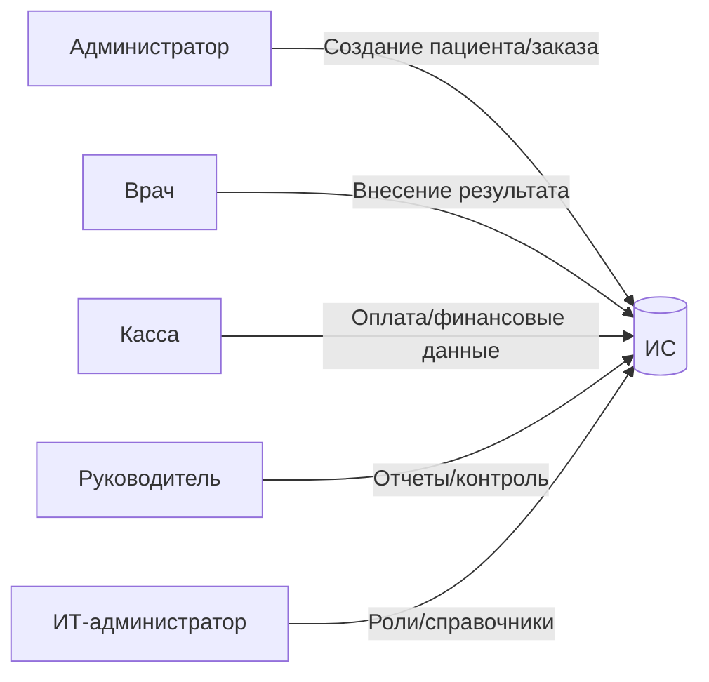

# Практика

---

## Этап 3. Формирование требований к системе

**Объект автоматизации:** процесс записи пациента и обработки заказа медицинских услуг.

---

## Что требуется выполнить в данном пункте  

В рамках Этапа 3 «Формирование требований к системе» студент обязан:

### 1) Сформировать функциональные требования (что делает система)

1. **Определить автоматизируемый процесс**, выбранный на Этапе 2 (например, «обработка заявок клиентов» / «запись пациента» / «учёт заказов»).
2. **Определить участников (роли)** процесса и пользователей системы (клиент, оператор/сотрудник, исполнитель, руководитель, бухгалтерия, администратор).
3. **Определить информационные объекты**, с которыми работает система (заявка, клиент, статусы, сроки, документы, отчёты, финансовые документы и т. п.).
4. **Составить перечень функциональных требований** в табличном виде (рекомендуемо 12–20 требований), где для каждого требования указать:

   * номер;
   * функция (название);
   * описание в проверяемой форме («система должна…»);
   * пользователь (роль);
   * ожидаемый результат (что должно быть получено/сохранено/отображено).
5. Включить в функциональные требования минимум следующие группы функций (адаптировать под свою область):

   * авторизация/вход;
   * роли и права доступа (RBAC);
   * создание и ведение основной сущности процесса (заявки/заказа/записи);
   * ведение карточки клиента/контрагента;
   * поиск и фильтрация;
   * назначение исполнителя/маршрутизация;
   * управление статусами по регламенту;
   * история изменений и аудит;
   * комментарии/вложения;
   * фиксация результата выполнения;
   * уведомления;
   * контроль сроков/просрочек;
   * отчетность;
   * экспорт данных/отчетов;
   * журналирование событий безопасности.

---

### 2) Сформировать нефункциональные требования (какими свойствами должна обладать система)

6. **Определить требования к качественным характеристикам** системы и сформулировать их **в измеримой форме** (числа, пределы, частота, критерий приемки).
7. Оформить нефункциональные требования таблицами по разделам (минимум):

   * производительность (время отклика, время операций, отчеты, параллельные пользователи);
   * надежность (доступность, восстановление, резервное копирование);
   * удобство использования (освоение, навигация, ошибки ввода, подсказки);
   * масштабируемость (рост данных, рост пользователей, расширение ролей/функций);
   * безопасность (аутентификация, разграничение доступа, журналирование, защита данных);
   * совместимость (ОС/браузеры, форматы экспорта, интеграции, требования к рабочим местам).
8. Указать **критерии измеримости/приемки** для каждого нефункционального требования (например, «≤ 2 сек», «≥ 99%», «не реже 1 раза/сутки», «не менее 20 пользователей»).

---

### 3) Зафиксировать итог для последующего проектирования

9. Убедиться, что требования:

   * **полные** (покрывают ключевые операции процесса),
   * **не противоречат** друг другу,
   * **проверяемы** (есть критерии приемки),
   * **связаны** с ролями и данными, выявленными на Этапах 1–2.
10. Объём и детализация должны быть достаточными для перехода к проектированию модулей, БД и интерфейсов (Этап 4).

---

## Важно

Приведённый выше перечень требований (для процесса обработки заявок) является **примером оформления Этапа 3**.

Данный пример:

* демонстрирует структуру раздела 3.1–3.2;
* показывает формат записи функциональных требований (функция → роль → результат);
* показывает способ задания нефункциональных требований в измеримой форме;
* задаёт минимальный набор групп требований, необходимых для проверяемости системы.

Студент обязан:

* выполнить формирование требований **для своей предметной области и выбранного процесса**;
* сохранить структуру подпунктов 3.1–3.2;
* сформулировать **свои** функциональные требования (под свои сущности, роли, документы, статусы);
* сформулировать **свои** нефункциональные требования с измеримыми критериями;
* не копировать пример дословно, а использовать его как шаблон оформления и уровня детализации.

---

# 3.1. Формирование функциональных требований

Функциональные требования формируются на основе:

* процессов, выявленных на Этапе 2;
* ролей пользователей (пациент, администратор, врач, касса, руководитель, ИТ);
* информационных объектов (пациент, заказ услуг, запись, статус, результат, счёт, отчёт).

Система предназначена для централизованной автоматизации записи пациента, маршрутизации заказа, контроля статусов, фиксации результатов и формирования отчетности.

---

## 3.1.1. Перечень функциональных требований (для медицинского центра)

| №      | Функция                             | Описание                                                                                                        | Пользователь                 | Результат                                             |
| ------ | ----------------------------------- | --------------------------------------------------------------------------------------------------------------- | ---------------------------- | ----------------------------------------------------- |
| 3.1.1  | Аутентификация пользователя         | Система должна обеспечивать вход по логину/паролю с проверкой роли.                                             | Все роли                     | Пользователь авторизован; права определены.           |
| 3.1.2  | Управление ролями (RBAC)            | Система должна обеспечивать назначение ролей (администратор, врач, касса, руководитель).                        | ИТ-администратор             | Права доступа настроены.                              |
| 3.1.3  | Создание карточки пациента          | Система должна обеспечивать создание карточки пациента с проверкой на дублирование.                             | Администратор                | Создана уникальная карточка пациента.                 |
| 3.1.4  | Редактирование карточки пациента    | Возможность обновления контактных данных с фиксацией изменений.                                                 | Администратор                | Данные актуализированы; история сохранена.            |
| 3.1.5  | Создание заказа услуг               | Система должна позволять формировать заказ с выбором услуг, филиала и времени.                                  | Администратор                | Создан заказ с уникальным номером и статусом «Новый». |
| 3.1.6  | Автоматический расчет стоимости     | Система должна рассчитывать стоимость на основе прайса и скидок.                                                | Администратор / Касса        | Отображена итоговая сумма заказа.                     |
| 3.1.7  | Назначение исполнителя              | Возможность назначения врача/кабинета с учетом расписания.                                                      | Администратор / Руководитель | Исполнитель назначен; запись создана.                 |
| 3.1.8  | Управление статусами                | Система должна обеспечивать переходы статусов по регламенту (Новый → Запланирован → Выполнен → Готов → Закрыт). | Администратор / Врач         | Статус обновлен и зафиксирован.                       |
| 3.1.9  | Ведение расписания                  | Система должна отображать загрузку врачей и кабинетов.                                                          | Руководитель / Администратор | Актуальное расписание отображено.                     |
| 3.1.10 | Фиксация результата услуги          | Врач должен иметь возможность внести протокол/заключение.                                                       | Врач                         | Результат сохранен; статус «Готов».                   |
| 3.1.11 | Уведомление пациента                | Автоматическая отправка уведомления о записи/готовности результата.                                             | Система                      | Уведомление отправлено; факт зафиксирован.            |
| 3.1.12 | Поиск и фильтрация заказов          | Поиск по ФИО, номеру заказа, дате, статусу, врачу.                                                              | Все внутренние роли          | Получен список заказов по критериям.                  |
| 3.1.13 | Контроль просрочек                  | Автоматическое выявление заказов с превышением срока выполнения.                                                | Руководитель                 | Сформирован список просроченных заказов.              |
| 3.1.14 | Формирование управленческих отчетов | Формирование отчетов по филиалам, врачам, услугам, выручке.                                                     | Руководитель                 | Сформирован отчет за период.                          |
| 3.1.15 | Выгрузка финансовых данных          | Формирование данных для бухгалтерии (счета, суммы, акты).                                                       | Касса / Бухгалтер            | Подготовлены документы учета.                         |
| 3.1.16 | Экспорт отчетов                     | Экспорт отчетов в PDF/Excel.                                                                                    | Руководитель                 | Отчет выгружен.                                       |
| 3.1.17 | Журнал действий пользователей       | Фиксация изменений заказов, пациентов, финансовых данных.                                                       | Система                      | Журнал событий сохранен.                              |
| 3.1.18 | Резервное администрирование         | Управление справочниками услуг, филиалов, сотрудников.                                                          | ИТ-администратор             | Справочники обновлены.                                |

---

### Логическая модель ролей и функций (Mermaid)

---

# 3.2. Формирование нефункциональных требований

Нефункциональные требования формируются с учетом специфики медицинской организации: большое количество записей, работа с персональными и медицинскими данными, межфилиальная работа.

---

## 3.2.1. Производительность

| Показатель          | Требование                       | Критерий           |
| ------------------- | -------------------------------- | ------------------ |
| Отклик интерфейса   | Отображение списка заказов       | ≤ 2 секунд         |
| Создание заказа     | Сохранение новой записи          | ≤ 1 секунды        |
| Генерация отчета    | Отчет по филиалу за месяц        | ≤ 5 секунд         |
| Параллельная работа | Одновременная работа сотрудников | ≥ 50 пользователей |

---

## 3.2.2. Надежность

| Показатель            | Требование                    | Критерий                     |
| --------------------- | ----------------------------- | ---------------------------- |
| Доступность           | Работа в рабочее время        | ≥ 99 %                       |
| Резервное копирование | Автоматическое создание копий | 1 раз/сутки                  |
| Восстановление        | Время восстановления          | ≤ 30 минут                   |
| Целостность           | Исключение потери данных      | Отсутствие потерь при аварии |

---

## 3.2.3. Удобство использования

| Показатель | Требование                  | Критерий                 |
| ---------- | --------------------------- | ------------------------ |
| Освоение   | Базовая работа без обучения | ≤ 30 минут               |
| Навигация  | Переход к функции           | ≤ 3 клика                |
| Валидация  | Контроль обязательных полей | Ошибки ≤ 5 %             |
| Подсказки  | Понятные сообщения          | Без технических терминов |

---

## 3.2.4. Масштабируемость

| Показатель    | Требование                           | Критерий                       |
| ------------- | ------------------------------------ | ------------------------------ |
| Рост филиалов | Подключение новых филиалов           | Без изменения архитектуры      |
| Рост данных   | Увеличение заказов в 5 раз           | Без падения производительности |
| Новые роли    | Добавление роли (например, лаборант) | Без изменения ядра системы     |
| Интеграция    | Возможность подключения API          | REST-интерфейс                 |

---

## 3.2.5. Безопасность

| Показатель       | Требование                | Критерий                         |
| ---------------- | ------------------------- | -------------------------------- |
| Аутентификация   | Обязательный вход         | 100 % операций через авторизацию |
| RBAC             | Разграничение доступа     | Нет доступа вне роли             |
| Логирование      | Журнал критичных действий | 100 % изменений фиксируются      |
| Шифрование       | Передача данных           | HTTPS                            |
| Защита медданных | Ограничение просмотра     | Только медицинские роли          |

---

## 3.2.6. Совместимость

| Показатель            | Требование               | Критерий           |
| --------------------- | ------------------------ | ------------------ |
| ОС                    | Windows / Linux          | Поддерживается     |
| Браузеры              | Chrome, Edge, Firefox    | Актуальные версии  |
| Экспорт               | PDF, Excel               | Поддерживается     |
| Интеграция            | С бухгалтерией           | API/файловый обмен |
| Аппаратные требования | Работа на стандартных ПК | ≥ 8 ГБ ОЗУ         |

---

# Итог Этапа 3

В результате:

* сформирован полный перечень функциональных требований (что делает система);
* определены измеримые нефункциональные требования (какими характеристиками обладает система);
* зафиксированы роли, данные и механизмы контроля;
* создана основа для перехода к проектированию архитектуры (Этап 4).

 