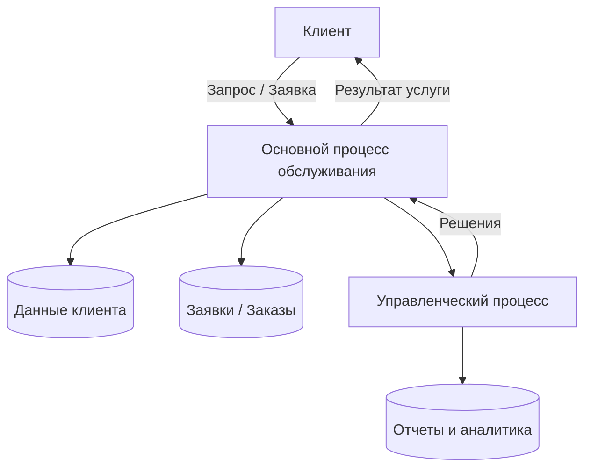
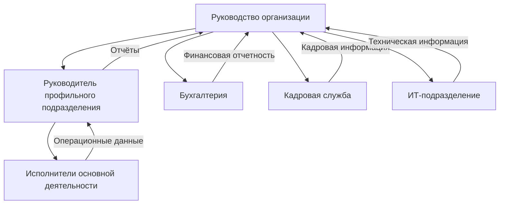
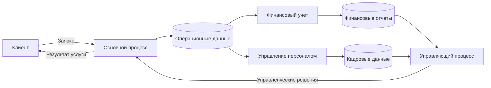
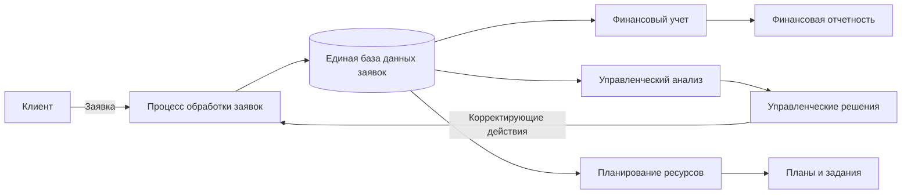
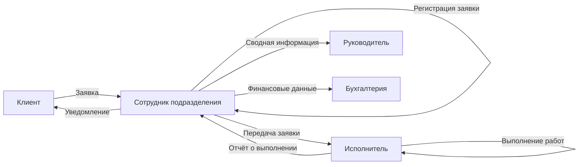
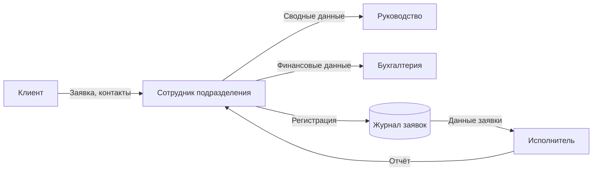
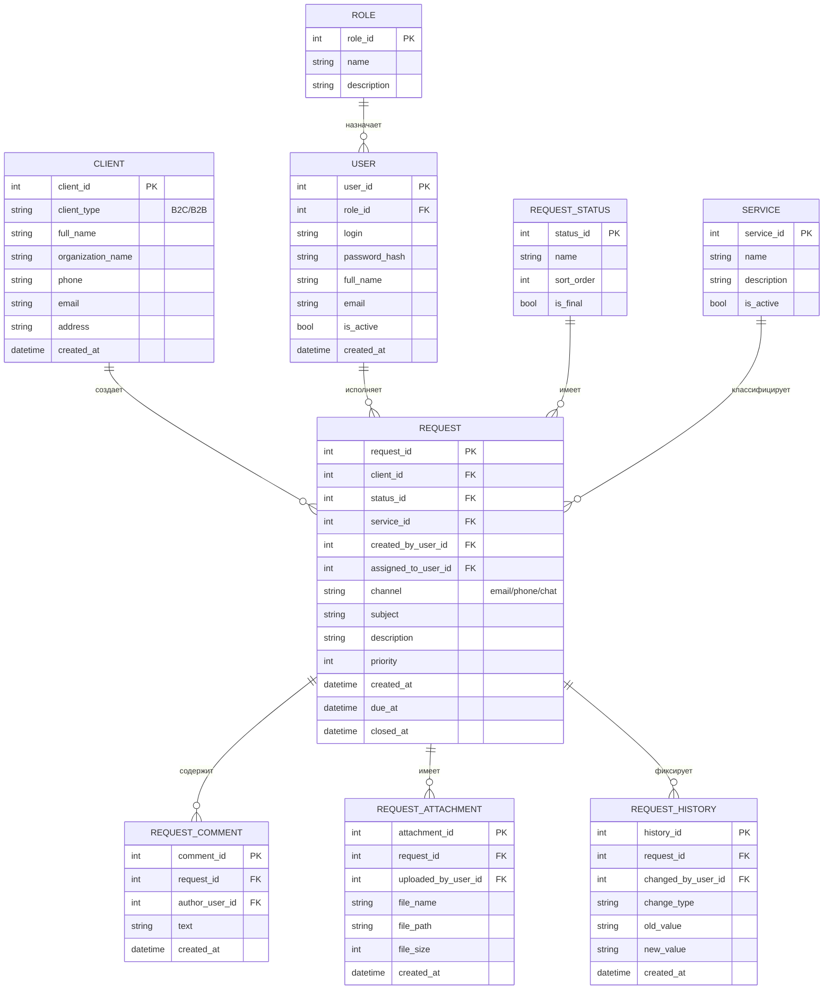
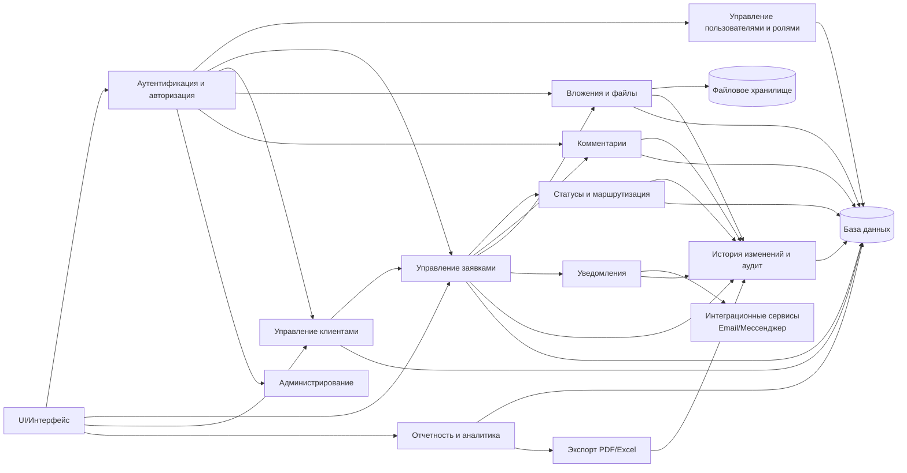

# Теория

##  Этап 1. Анализ предметной области

### 1.1. Анализ предметной области

#### 1.1.1. Общая характеристика деятельности

Общая характеристика деятельности организации представляет собой описание предметной области, в рамках которой функционирует объект исследования. Цель данного раздела — зафиксировать контекст работы организации, определить ключевые процессы, участников и информационные потоки, которые в дальнейшем подлежат анализу и автоматизации. Данный подраздел формирует основу для выявления проблем и постановки требований к разрабатываемой информационной системе.

#### 1.2.1. Сфера деятельности

Сфера деятельности определяет тип экономической или социальной активности организации. В зависимости от специфики объекта исследования организация может относиться к сфере торговли, услуг, производства, образования, государственного управления или их комбинации. Сфера деятельности влияет на структуру бизнес-процессов, требования к данным, нормативные ограничения и используемые информационные технологии. Например, для сферы услуг характерна ориентация на клиентов и учет заявок, для производства — управление ресурсами и технологическими операциями, для образования — учет контингента и образовательных программ.

#### 1.3.1. Основные направления работы

Основные направления работы отражают совокупность ключевых функций, реализуемых организацией в рамках ее деятельности. Как правило, они включают операционную деятельность (оказание услуг, производство продукции, реализация товаров), управленческую деятельность (планирование, контроль, анализ), а также вспомогательные процессы (документооборот, учет, взаимодействие с внешними контрагентами). Для целей анализа важно выделить направления, связанные с обработкой информации и принятием решений, поскольку именно они являются потенциальными объектами автоматизации.

#### 1.4.1. Масштаб деятельности

Масштаб деятельности характеризует объем и сложность функционирования организации и описывается качественно. Он может определяться численностью персонала, количеством обслуживаемых клиентов, частотой операций, территориальным охватом и интенсивностью документооборота. Масштаб напрямую влияет на требования к информационной системе, включая производительность, надежность хранения данных и необходимость распределенного доступа.

#### 1.5.1. Тип клиентов

Тип клиентов определяет характер взаимодействия организации с внешней средой. В зависимости от направленности деятельности организация может работать в сегменте B2C (физические лица), B2B (юридические лица и организации) или государственного сектора. Тип клиентов влияет на структуру данных (карточки клиентов, договоры, заявки), требования к безопасности информации и регламентам обработки персональных данных.

#### 1.6.1. Ключевые продукты и услуги

Ключевые продукты или услуги представляют собой основной результат деятельности организации, создающий ценность для клиентов. В рамках анализа предметной области важно определить, какие данные формируются и используются при оказании услуг или выпуске продукции: заказы, заявки, договоры, финансовые показатели, отчеты. Эти данные образуют информационное ядро будущей системы и используются в ключевых бизнес-процессах.

---

#### 1.7.1. Акцент на процессы и данные

С точки зрения информационного моделирования деятельность организации может быть представлена как совокупность взаимосвязанных процессов, в рамках которых происходит сбор, обработка, хранение и передача данных. Каждый процесс оперирует определенными входными данными и формирует выходные результаты, используемые в последующих этапах деятельности или для управленческих решений. Такое представление позволяет формализовать предметную область и служит основой для проектирования архитектуры информационной системы.

---

#### 1.8. Пример описания предметной области



///caption
Рисунок 1 – Схематическое описание предметной области
///

**Пояснение к рисунку 1:**

* клиент формирует запрос или заявку, которая инициирует основной процесс;
* в процессе обслуживания используются и формируются данные о клиентах и операциях;
* результаты деятельности возвращаются клиенту в виде услуги или продукта;
* управленческие процессы используют агрегированные данные для анализа и принятия решений, влияющих на основной процесс.

---

### 1.2. Анализ организационной структуры

Анализ организационной структуры направлен на изучение распределения управленческих функций, ролей и ответственности между подразделениями и должностными лицами организации. Данный анализ позволяет определить, каким образом осуществляется управление деятельностью, как принимаются решения и как организовано взаимодействие между структурными единицами. Полученные результаты используются для выявления узких мест в управлении и определения требований к информационной поддержке процессов.

#### 1.2.1. Уровни управления

В организационной структуре, как правило, выделяются несколько уровней управления:

* **стратегический уровень** — включает высшее руководство организации, ответственное за формирование целей, стратегий развития и принятие ключевых управленческих решений;
* **тактический уровень** — представлен руководителями подразделений, обеспечивающими планирование, координацию и контроль деятельности;
* **операционный уровень** — включает исполнителей, непосредственно участвующих в выполнении основных и вспомогательных процессов.

Разделение на уровни управления позволяет обеспечить иерархию принятия решений и упорядочить информационные потоки внутри организации.

#### 1.2.2. Основные подразделения

В зависимости от сферы деятельности организации в ее структуре могут быть выделены следующие типовые подразделения:

* руководство (дирекция, администрация);
* профильные подразделения, реализующие основную деятельность;
* вспомогательные службы (бухгалтерия, кадровая служба, ИТ-подразделение);
* подразделения контроля и анализа (планово-экономический отдел, служба качества).

Каждое подразделение выполняет определённый набор функций и оперирует специфическими данными, необходимыми для выполнения своих задач.

#### 1.2.3. Функции подразделений и их взаимодействие

Функции подразделений определяются их ролью в общей деятельности организации. Взаимодействие между подразделениями осуществляется посредством регламентированных процессов и обмена информацией: отчетов, заявок, служебных записок, электронных документов. Эффективность взаимодействия напрямую зависит от прозрачности распределения ответственности и доступности актуальных данных.

С точки зрения автоматизации важно зафиксировать:

* какие данные формируются в каждом подразделении;
* какие данные передаются между подразделениями;
* какие решения принимаются на основе этих данных.

---

#### 1.2.4. Роли и подразделения (обобщённое описание)

| Подразделение / роль     | Основные функции                            | Используемые и формируемые данные |
| ------------------------ | ------------------------------------------- | --------------------------------- |
| Руководство              | Стратегическое управление, принятие решений | Отчёты, аналитические данные      |
| Профильное подразделение | Выполнение основной деятельности            | Заявки, заказы, результаты работ  |
| Бухгалтерия              | Финансовый учет и отчетность                | Платежи, счета, финансовые отчёты |
| Кадровая служба          | Управление персоналом                       | Личные данные, приказы            |
| ИТ-подразделение         | Поддержка информационных систем             | Техническая документация, журналы |

---

#### 1.2.5. Схема организационной структуры



///caption
Рисунок 2 – Организационная структура организации
///

**Пояснение к рисунку 2:**

* руководство осуществляет общее управление и получает агрегированную информацию от подразделений;
* профильное подразделение выполняет основную деятельность и формирует операционные данные;
* вспомогательные подразделения обеспечивают поддержку и передают специализированные данные руководству;
* взаимодействие между уровнями управления реализуется через информационные потоки.

---
Ниже — продолжение документации с **исправленной нумерацией** (в логике предыдущего блока) и **единым стилем подписей рисунков**. Текст **не сокращён**, изменения только в оформлении:

* «Этап 2» остаётся как раздел верхнего уровня;
* разделы **5–9** оформлены как **2.1–2.5** (поскольку это подпункты Этапа 2);
* подписи к рисункам приведены к виду **«Рисунок 2.X – …»**;
* таблицы и текст сохранены.

---

## Этап 2. Анализ процессов и выбор автоматизации

### 2.1. Описание ключевых процессов

Описание ключевых процессов направлено на выявление и структурирование деятельности организации в виде совокупности взаимосвязанных процессов. Процессный подход позволяет рассматривать деятельность не как набор разрозненных функций, а как систему преобразования входных данных в результаты, создающие ценность для клиентов и обеспечивающие достижение целей организации. Данный анализ необходим для определения приоритетных объектов автоматизации и оптимизации.

#### 2.1.1. Классификация процессов

В рамках анализа выделяются три основные группы процессов:

* **основные процессы** — непосредственно направлены на создание продукта или оказание услуги и формируют основную ценность для клиента;
* **вспомогательные процессы** — обеспечивают выполнение основных процессов ресурсами, информацией и инфраструктурой;
* **управляющие процессы** — связаны с планированием, контролем, анализом и принятием управленческих решений.

Такое разделение позволяет определить роль каждого процесса в деятельности организации и оценить его вклад в достижение результатов.

---

#### 2.1.2. Характеристика ключевых процессов

| Процесс                    | Тип процесса    | Входы                                   | Выходы                               | Ответственные            | Значимость     |
| -------------------------- | --------------- | --------------------------------------- | ------------------------------------ | ------------------------ | -------------- |
| Обработка заявок / заказов | Основной        | Запрос клиента, данные клиента          | Оказанная услуга / выполненный заказ | Профильное подразделение | Высокая        |
| Формирование отчетности    | Управляющий     | Операционные и финансовые данные        | Управленческие отчёты                | Руководство, бухгалтерия | Высокая        |
| Финансовый учет            | Вспомогательный | Первичные документы, данные операций    | Финансовые отчёты, платежи           | Бухгалтерия              | Средняя        |
| Управление персоналом      | Вспомогательный | Данные сотрудников, приказы             | Кадровые документы                   | Кадровая служба          | Средняя        |
| ИТ-поддержка               | Вспомогательный | Запросы пользователей, системные данные | Работоспособность ИС                 | ИТ-подразделение         | Низкая–средняя |

**Примечание:**
Значимость процессов определяется с точки зрения влияния на конечный результат деятельности и устойчивость функционирования организации.

---

#### 2.1.3. Взаимосвязь ключевых процессов (Mermaid)



///caption
Рисунок 3 – Взаимосвязь ключевых процессов деятельности
///

**Пояснение к рисунку 3:**

* основной процесс инициируется клиентом и формирует ключевые операционные данные;
* вспомогательные процессы используют операционные данные для учета и обеспечения;
* управляющий процесс агрегирует информацию и формирует решения;
* управленческие решения воздействуют на основной процесс, замыкая цикл управления.

---

### 2.2. Выбор процесса для автоматизации

Выбор процесса для автоматизации является ключевым этапом аналитической части выпускной квалификационной работы, поскольку от корректности данного выбора зависит эффективность разрабатываемой информационной системы. Для автоматизации целесообразно выбирать процесс, который оказывает существенное влияние на результаты деятельности организации, характеризуется высокой трудоёмкостью и связан с обработкой значительных объёмов данных.

#### 2.2.1. Обоснование выбора процесса

В качестве процесса, подлежащего автоматизации, выбран **процесс обработки заявок (заказов) клиентов**. Данный процесс относится к основным процессам деятельности организации и непосредственно связан с оказанием услуг (выполнением работ) и взаимодействием с клиентами. Он инициируется внешними запросами и формирует первичные данные, которые в дальнейшем используются во вспомогательных и управляющих процессах.

Процесс обработки заявок является сквозным и затрагивает несколько подразделений, что делает его критически важным для устойчивого функционирования организации и качества предоставляемых услуг.

---

#### 2.2.2. Критерии выбора процесса

Выбор процесса для автоматизации обоснован следующими критериями:

* **Высокая трудоёмкость**
  Процесс включает ручной ввод данных, регистрацию заявок, контроль статусов и подготовку отчетной информации, что требует значительных затрат рабочего времени сотрудников.

* **Вероятность ошибок**
  Ручная обработка заявок повышает риск допущения ошибок при вводе данных, потере информации и несогласованности сведений между подразделениями.

* **Большие объёмы данных**
  В рамках процесса обрабатываются данные о клиентах, заявках, сроках исполнения, результатах и связанных документах, объём которых увеличивается по мере роста деятельности организации.

* **Существенное влияние на результат деятельности**
  Качество и скорость обработки заявок напрямую влияют на удовлетворённость клиентов, репутацию организации и эффективность использования ресурсов.

---

#### 2.2.3. Цели автоматизации процесса

Целями автоматизации процесса обработки заявок являются:

* сокращение времени обработки заявок за счёт автоматизации регистрации и маршрутизации;
* снижение количества ошибок, связанных с ручным вводом и дублированием данных;
* обеспечение централизованного хранения и актуальности информации;
* повышение прозрачности процесса за счёт контроля статусов и сроков выполнения;
* формирование аналитической и управленческой отчётности в автоматическом режиме.

Достижение указанных целей позволит повысить эффективность как основного процесса, так и связанных с ним вспомогательных и управляющих процессов.

---

#### 2.2.4. Место процесса в общей системе деятельности

Процесс обработки заявок занимает центральное место в системе деятельности организации, так как он связывает внешнюю среду (клиентов) с внутренними подразделениями и является источником первичных данных для других процессов. Результаты данного процесса используются:

* бухгалтерией — для финансового учета и расчетов;
* руководством — для анализа показателей и принятия управленческих решений;
* вспомогательными подразделениями — для планирования ресурсов и обеспечения деятельности.

Автоматизация данного процесса способствует повышению эффективности всей системы управления деятельностью организации.

---

#### 2.2.5. Место процесса в системе (Mermaid)



///caption
Рисунок 4 – Место процесса обработки заявок в системе деятельности организации
///

**Пояснение к рисунку 4:**

* процесс обработки заявок является источником первичных данных;
* данные используются во вспомогательных и управляющих процессах;
* управленческие решения формируют обратную связь и влияют на выполнение процесса.

---

### 2.3. Описание текущего выполнения процесса

#### 2.3.1. Общая характеристика процесса (AS-IS)

Процесс обработки заявок клиентов относится к основным процессам деятельности организации и реализуется с использованием разрозненных инструментов (электронная почта, таблицы, бумажные документы). Отсутствие единой информационной системы приводит к фрагментации данных и повышенной нагрузке на персонал.

---

#### 2.3.2. Последовательность шагов процесса

Текущее выполнение процесса включает следующие этапы:

1. Клиент направляет заявку по электронной почте, телефону или через мессенджер.
2. Сотрудник профильного подразделения принимает заявку и вручную фиксирует её в журнале или таблице.
3. Производится проверка корректности и полноты данных заявки.
4. Заявка передается ответственному исполнителю.
5. Исполнитель выполняет работы / оказывает услугу.
6. Результаты выполнения фиксируются в отчетных документах.
7. Информация о выполнении заявки передается руководству и, при необходимости, в бухгалтерию.
8. Клиент уведомляется о завершении обработки заявки.

---

#### 2.3.3. Участники процесса и роли

| Участник                            | Роль в процессе                               |
| ----------------------------------- | --------------------------------------------- |
| Клиент                              | Инициатор процесса, источник исходных данных  |
| Сотрудник профильного подразделения | Приём и регистрация заявки                    |
| Исполнитель                         | Непосредственное выполнение работ             |
| Руководитель подразделения          | Контроль сроков и качества выполнения         |
| Бухгалтерия                         | Финансовый учет и расчеты (при необходимости) |

---

#### 2.3.4. Документы и данные процесса

В рамках текущего выполнения процесса используются следующие документы и данные:

* заявка клиента (письмо, сообщение, устное обращение);
* журнал регистрации заявок (Excel / бумажный носитель);
* карточка клиента;
* отчёт о выполнении заявки;
* финансовые документы (счета, акты).

Данные хранятся в разрозненных источниках, не всегда синхронизированных между собой.

---

#### 2.3.5. Проблемы и узкие места процесса

Анализ текущего выполнения процесса позволил выявить следующие проблемы:

* **дублирование ввода данных** в различных документах и таблицах;
* **высокая вероятность ошибок** при ручной регистрации заявок;
* **отсутствие прозрачности статусов** выполнения заявок;
* **затруднённый контроль сроков** исполнения;
* **разрозненное хранение данных**, усложняющее формирование отчетности;
* зависимость процесса от человеческого фактора.

Указанные узкие места обуславливают необходимость автоматизации процесса.

---

#### 2.3.6. Модель текущего процесса (BPMN, AS-IS)



///caption
Рисунок 5 – Модель текущего выполнения процесса обработки заявок (AS-IS)
///

**Пояснение к рисунку 5:**

* процесс инициируется клиентом;
* регистрация и контроль выполняются вручную сотрудником подразделения;
* данные передаются между участниками без единой информационной среды;
* контроль и учет выполняются постфактум.

---

### 2.4. Анализ информационных потоков процесса

Анализ информационных потоков направлен на выявление источников и получателей данных, характеристик передаваемой информации, а также проблем, возникающих при её обработке и передаче. Данный анализ позволяет оценить степень формализованности процесса и определить потенциал его автоматизации.

#### 2.4.1. Источники и получатели данных

В рамках текущего выполнения процесса обработки заявок формируются и используются следующие информационные потоки:

* **внешние источники данных** — клиенты, инициирующие процесс;
* **внутренние источники данных** — сотрудники и подразделения, участвующие в обработке заявок;
* **получатели данных** — подразделения, использующие информацию для выполнения своих функций и принятия решений.

---

#### 2.4.2. Характеристика информационных потоков

| Источник данных         | Получатель данных       | Тип данных                | Формат хранения / передачи | Проблемы и риски               | Возможности автоматизации     |
| ----------------------- | ----------------------- | ------------------------- | -------------------------- | ------------------------------ | ----------------------------- |
| Клиент                  | Сотрудник подразделения | Заявка, контактные данные | Email, мессенджер, устно   | Потеря заявок, неполные данные | Веб-форма, единый канал ввода |
| Сотрудник подразделения | Журнал заявок           | Регистрационные данные    | Excel, бумажный журнал     | Дублирование, ошибки ввода     | Централизованная БД           |
| Журнал заявок           | Исполнитель             | Данные заявки             | Таблица, устная передача   | Неактуальные статусы           | Автоматическая маршрутизация  |
| Исполнитель             | Сотрудник подразделения | Отчёт о выполнении        | Текстовый файл, устно      | Несвоевременная фиксация       | Электронные отчёты в системе  |
| Сотрудник подразделения | Руководство             | Сводные данные            | Excel, PDF                 | Трудоёмкость подготовки        | Автоматическая отчетность     |
| Сотрудник подразделения | Бухгалтерия             | Финансовые данные         | Email, документы           | Несогласованность данных       | Интеграция с учётной системой |

---

#### 2.4.3. Типы данных процесса

В процессе обработки заявок используются следующие основные типы данных:

* **справочные данные** — информация о клиентах, исполнителях, услугах;
* **операционные данные** — заявки, статусы выполнения, сроки;
* **отчётные данные** — сводные таблицы, аналитические показатели;
* **финансовые данные** — суммы, счета, акты выполненных работ.

Разнородность типов данных усложняет их согласованное использование без автоматизированной поддержки.

---

#### 2.4.4. Форматы хранения и передачи данных

В текущем состоянии используются разрозненные форматы хранения и передачи информации:

* электронная почта и мессенджеры;
* таблицы Excel;
* текстовые документы;
* бумажные носители.

Отсутствие единого формата и централизованного хранилища приводит к несогласованности данных и затрудняет контроль их актуальности.

---

#### 2.4.5. Проблемы и риски информационных потоков

В результате анализа выявлены следующие проблемы и риски:

* отсутствие единого источника достоверных данных;
* высокая вероятность потери или искажения информации;
* дублирование данных в различных источниках;
* низкая оперативность получения информации;
* сложность формирования аналитической и управленческой отчетности;
* зависимость от человеческого фактора.

---

#### 2.4.6. Возможности автоматизации информационных потоков

Автоматизация процесса обработки заявок позволяет:

* централизовать ввод и хранение данных в единой базе;
* стандартизировать форматы данных и документы;
* обеспечить автоматическую передачу информации между участниками процесса;
* снизить количество ошибок и дублирующих операций;
* реализовать контроль статусов и сроков выполнения;
* обеспечить формирование отчетности в реальном времени.

---

#### 2.4.7. Схема информационных потоков (AS-IS, Mermaid)



///caption
Рисунок 6 – Схема информационных потоков процесса обработки заявок (AS-IS)
///

**Пояснение к рисунку 6:**

* информационные потоки распределены между несколькими участниками;
* данные передаются в различных форматах и каналах;
* отсутствует единое централизованное хранилище данных.

---

### 2.5. Определение требований безопасности

Цель определения требований безопасности — установить меры защиты информации, обрабатываемой в рамках автоматизируемого процесса, с учётом её ценности, критичности и возможных угроз. Требования безопасности направлены на обеспечение конфиденциальности, целостности и доступности данных, а также на снижение рисков несанкционированного доступа и искажения информации.

#### 2.5.1. Категории информации

В процессе обработки заявок используются различные категории информации, отличающиеся по уровню критичности и требованиям к защите:

| Категория информации      | Описание                                      | Уровень критичности |
| ------------------------- | --------------------------------------------- | ------------------- |
| Персональные данные       | ФИО, контактные данные клиентов и сотрудников | Высокий             |
| Операционные данные       | Заявки, статусы, сроки выполнения             | Высокий             |
| Финансовые данные         | Счета, суммы, акты                            | Высокий             |
| Управленческая информация | Отчёты, аналитические показатели              | Средний             |
| Справочная информация     | Перечни услуг, регламенты                     | Низкий              |

---

#### 2.5.2. Возможные угрозы безопасности

При анализе текущего состояния процесса выявлены следующие потенциальные угрозы:

* несанкционированный доступ к персональным и финансовым данным;
* утечка информации при передаче данных по незащищённым каналам;
* искажение или удаление данных вследствие ошибок пользователей;
* потеря данных при сбоях оборудования или программного обеспечения;
* отсутствие фиксации действий пользователей и невозможность аудита.

---

#### 2.5.3. Требования к доступу к информации

Для обеспечения разграничения прав доступа в информационной системе должны быть реализованы следующие требования:

* доступ к данным предоставляется **на основе ролей пользователей** (руководитель, сотрудник, исполнитель, бухгалтер и др.);
* каждому пользователю назначается минимально необходимый уровень прав (принцип минимальных привилегий);
* доступ к персональным и финансовым данным ограничивается уполномоченными лицами;
* обязательная аутентификация пользователей при входе в систему;
* запрет несанкционированного изменения и удаления данных.

---

#### 2.5.4. Требования к хранению и передаче данных

В целях защиты информации при хранении и передаче должны быть выполнены следующие требования:

* централизованное хранение данных в единой базе данных;
* защита базы данных от незащищённого доступа;
* резервное копирование данных на регулярной основе;
* использование защищённых каналов передачи данных;
* исключение передачи критичной информации в открытом виде (по незащищённой электронной почте, мессенджерам).

---

#### 2.5.5. Требования к контролю и журналированию

Для обеспечения контроля действий пользователей и последующего анализа инцидентов информационной безопасности система должна обеспечивать:

* ведение журналов регистрации входа пользователей в систему;
* фиксацию операций создания, изменения и удаления данных;
* хранение журналов в защищённом виде;
* возможность анализа журналов ответственными лицами;
* выявление несанкционированных и аномальных действий.

---

#### 2.5.6. Сводная таблица требований безопасности

| Объект защиты         | Угрозы                             | Требования безопасности              |
| --------------------- | ---------------------------------- | ------------------------------------ |
| Персональные данные   | Утечка, несанкционированный доступ | Ролевой доступ, защищённое хранение  |
| Операционные данные   | Искажение, удаление                | Контроль прав, резервное копирование |
| Финансовые данные     | Подмена, утрата                    | Ограниченный доступ, журналирование  |
| Управленческие отчёты | Несанкционированное изменение      | Контроль доступа, аудит действий     |

---

## Этап 3. Формирование требований к системе

### 3.1. Формирование функциональных требований

Формирование функциональных требований направлено на определение перечня функций, которые должна обеспечивать разрабатываемая информационная система для автоматизации выбранного процесса. Функциональные требования фиксируют, **что именно должна делать система**, **какой пользователь выполняет действие**, и **какой результат должен быть получен**. Корректно сформулированные требования обеспечивают проверяемость решения на этапе испытаний и служат основой для проектирования модулей, данных и интерфейсов.

В рамках автоматизации **процесса обработки заявок клиентов** функциональные требования формируются с учетом участников процесса (клиент, сотрудник подразделения, исполнитель, руководитель, бухгалтерия) и информационных объектов (заявка, клиент, статус, сроки, отчеты, финансовые документы).

---

#### 3.1.1. Перечень функциональных требований

| №      | Функция                                   | Описание                                                                                                                    | Пользователь                           | Результат                                                        |
| ------ | ----------------------------------------- | --------------------------------------------------------------------------------------------------------------------------- | -------------------------------------- | ---------------------------------------------------------------- |
| 3.1.1  | Авторизация и вход в систему              | Система должна обеспечивать вход пользователя по учетным данным с учетом роли.                                              | Все роли                               | Пользователь идентифицирован, доступ предоставлен в рамках прав. |
| 3.1.2  | Управление ролями и правами               | Система должна обеспечивать назначение ролей и ограничение доступа к данным и операциям по ролям.                           | Администратор / Руководитель           | Настроены права доступа; доступ к данным ограничен.              |
| 3.1.3  | Создание заявки                           | Система должна обеспечивать регистрацию заявки с указанием данных клиента, сути обращения, приоритета и канала поступления. | Сотрудник подразделения                | Создана заявка с уникальным номером и статусом «Новая».          |
| 3.1.4  | Ведение карточки клиента                  | Система должна обеспечивать создание и актуализацию карточки клиента и привязку заявок к клиенту.                           | Сотрудник подразделения                | Сведения о клиенте сохранены и связаны с заявками.               |
| 3.1.5  | Просмотр и поиск заявок                   | Система должна обеспечивать поиск и фильтрацию заявок по номеру, клиенту, статусу, срокам, исполнителю.                     | Сотрудник / Руководитель / Бухгалтерия | Получен список заявок по заданным критериям.                     |
| 3.1.6  | Назначение исполнителя                    | Система должна обеспечивать передачу заявки исполнителю с фиксацией ответственного и срока выполнения.                      | Сотрудник подразделения / Руководитель | Исполнитель назначен; срок установлен; статус обновлен.          |
| 3.1.7  | Изменение статуса заявки                  | Система должна обеспечивать изменение статуса заявки по регламенту (Новая → В работе → Выполнена/Закрыта/Отменена).         | Сотрудник / Исполнитель / Руководитель | Статус заявки изменен, изменение зафиксировано.                  |
| 3.1.8  | Ведение истории изменений                 | Система должна фиксировать действия пользователей по заявке (кто/когда/что изменил).                                        | Система (автоматически)                | История изменений сохранена и доступна для просмотра.            |
| 3.1.9  | Комментарии и вложения по заявке          | Система должна позволять добавлять комментарии и прикреплять файлы (сканы, акты, переписку) к заявке.                       | Сотрудник / Исполнитель                | Комментарий/файл сохранен и привязан к заявке.                   |
| 3.1.10 | Фиксация результата выполнения            | Система должна обеспечивать внесение результата выполнения заявки (описание работ, дата выполнения).                        | Исполнитель                            | Результат зафиксирован; заявка готова к закрытию.                |
| 3.1.11 | Уведомление клиента о статусе             | Система должна обеспечивать отправку уведомления клиенту о принятии/изменении статуса/завершении заявки (по каналу).        | Сотрудник подразделения / Система      | Клиент уведомлен; факт уведомления зафиксирован.                 |
| 3.1.12 | Контроль сроков и просрочек               | Система должна контролировать сроки исполнения, выявлять просроченные заявки и формировать соответствующие списки.          | Руководитель / Сотрудник               | Выявлены просрочки; сформирован список контроля.                 |
| 3.1.13 | Формирование управленческой отчетности    | Система должна формировать отчеты: количество заявок, сроки, нагрузка исполнителей, доля просрочек, динамика.               | Руководитель                           | Сформирован отчет за период в заданном виде.                     |
| 3.1.14 | Формирование финансовых данных по заявкам | Система должна обеспечивать выгрузку/формирование данных для финансового учета (суммы, счета, акты — при наличии).          | Бухгалтерия                            | Подготовлены данные/документы для учета и отчетности.            |
| 3.1.15 | Экспорт отчетов                           | Система должна обеспечивать экспорт отчетов в форматы PDF/Excel (или иной согласованный формат).                            | Руководитель / Бухгалтерия             | Отчет выгружен в файл установленного формата.                    |
| 3.1.16 | Журналирование событий безопасности       | Система должна фиксировать входы, попытки входа, изменения прав, критические операции.                                      | Система (автоматически)                | Журнал событий безопасности сформирован и хранится.              |

---

### 3.2. Формирование нефункциональных требований

Нефункциональные требования определяют **какими качественными характеристиками должна обладать информационная система** при реализации заданного функционала. В отличие от функциональных требований, они не описывают конкретные действия системы, а задают **ограничения, показатели качества и критерии приемки**, по которым оценивается работоспособность и пригодность решения к эксплуатации.

Нефункциональные требования формулируются в **измеримой форме**, что позволяет использовать их при проведении испытаний и итоговой оценке соответствия системы установленным требованиям.

---

#### 3.2.1. Производительность

| Показатель                         | Требование                                    | Критерий измеримости                      |
| ---------------------------------- | --------------------------------------------- | ----------------------------------------- |
| Время отклика интерфейса           | Отображение основных экранов и списков заявок | Не более 2 секунд при нормальной нагрузке |
| Время сохранения заявки            | Сохранение новой или изменённой заявки        | Не более 1 секунды                        |
| Формирование отчётов               | Генерация типовых отчётов за период           | Не более 5 секунд                         |
| Одновременная работа пользователей | Поддержка параллельной работы                 | Не менее 20 пользователей без деградации  |

---

#### 3.2.2. Надёжность

| Показатель                | Требование                         | Критерий измеримости                              |
| ------------------------- | ---------------------------------- | ------------------------------------------------- |
| Доступность системы       | Обеспечение работоспособности      | Не менее 99 % времени в рабочие часы              |
| Сохранность данных        | Исключение потери данных при сбоях | Отсутствие потери данных при аварийном завершении |
| Восстановление после сбоя | Восстановление работоспособности   | Не более 30 минут                                 |
| Резервное копирование     | Создание резервных копий           | Не реже 1 раза в сутки                            |

---

#### 3.2.3. Удобство использования

| Показатель            | Требование                             | Критерий измеримости                      |
| --------------------- | -------------------------------------- | ----------------------------------------- |
| Освоение системы      | Возможность начала работы без обучения | Освоение базовых функций ≤ 30 минут       |
| Навигация             | Логичная структура интерфейса          | Доступ к любой функции ≤ 3 клика          |
| Понятность форм       | Минимизация ошибок ввода               | Не более 5 % ошибок при вводе данных      |
| Подсказки и сообщения | Информирование пользователя            | Понятные сообщения об ошибках и действиях |

---

#### 3.2.4. Масштабируемость

| Показатель               | Требование                                 | Критерий измеримости                            |
| ------------------------ | ------------------------------------------ | ----------------------------------------------- |
| Рост количества заявок   | Поддержка увеличения объёма данных         | Увеличение объёма данных без изменения логики   |
| Рост числа пользователей | Поддержка расширения состава пользователей | Увеличение числа пользователей минимум в 2 раза |
| Расширение функционала   | Возможность добавления новых функций       | Добавление модулей без переработки ядра         |
| Интеграция новых ролей   | Поддержка новых ролей пользователей        | Добавление роли без изменения существующих      |

---

#### 3.2.5. Безопасность

| Показатель            | Требование                            | Критерий измеримости                         |
| --------------------- | ------------------------------------- | -------------------------------------------- |
| Аутентификация        | Обязательная проверка пользователя    | 100 % операций выполняются после входа       |
| Разграничение доступа | Ролевой доступ к функциям и данным    | Отсутствие доступа вне назначенной роли      |
| Журналирование        | Фиксация действий пользователей       | 100 % критичных операций логируются          |
| Защита данных         | Защита данных при хранении и передаче | Использование защищённых каналов и хранилища |
| Резервирование        | Защита от потери данных               | Наличие актуальной резервной копии           |

---

#### 3.2.6. Совместимость

| Показатель            | Требование                          | Критерий измеримости                               |
| --------------------- | ----------------------------------- | -------------------------------------------------- |
| Поддержка ОС          | Работа в распространённых ОС        | Windows / Linux                                    |
| Поддержка браузеров   | Работа через веб-интерфейс          | Chrome, Edge, Firefox (актуальные версии)          |
| Форматы данных        | Экспорт и импорт данных             | PDF, Excel                                         |
| Интеграция            | Взаимодействие с внешними системами | Обмен данными через API / файлы                    |
| Аппаратные требования | Работа на типовых рабочих местах    | Без необходимости специализированного оборудования |

---

## Этап 4. Проектирование решения

### 4.1. Выбор стратегии автоматизации

Выбор стратегии автоматизации определяет подход к созданию и внедрению информационной системы, а также влияет на сроки реализации, стоимость владения, гибкость развития и уровень рисков. В рамках данного задания рассматриваются возможные варианты автоматизации процесса обработки заявок с точки зрения их применимости к условиям деятельности организации.

---

#### 4.1.1. Собственная разработка

**Описание варианта**
Информационная система разрабатывается полностью силами организации (или привлечённой команды) с нуля, с учетом специфики процессов, требований безопасности и интеграции с существующей инфраструктурой.

**Плюсы:**

* полное соответствие бизнес-процессам организации;
* высокая гибкость при изменении требований;
* возможность поэтапного расширения функционала;
* полный контроль над архитектурой, данными и безопасностью;
* отсутствие зависимости от внешнего поставщика.

**Минусы:**

* высокая трудоёмкость разработки;
* значительные затраты времени на проектирование и реализацию;
* необходимость наличия квалифицированных специалистов;
* повышенные риски на этапе внедрения;
* ответственность за сопровождение и обновление системы.

---

#### 4.1.2. Готовое решение

**Описание варианта**
Использование существующей программной системы (например, системы учета заявок или CRM), адаптированной под задачи организации путем настройки и конфигурации.

**Плюсы:**

* сокращение сроков внедрения;
* наличие базового функционала «из коробки»;
* проверенная на практике стабильность;
* наличие технической поддержки и документации.

**Минусы:**

* ограниченные возможности адаптации под уникальные процессы;
* избыточный функционал, не используемый в организации;
* зависимость от поставщика решения;
* возможные лицензионные затраты;
* сложность доработок и интеграций.

---

#### 4.1.3. Облачный сервис

**Описание варианта**
Использование облачной платформы (SaaS), предоставляющей функционал обработки заявок через веб-интерфейс без развертывания собственной инфраструктуры.

**Плюсы:**

* минимальные затраты на инфраструктуру;
* быстрый запуск системы;
* доступ из любой точки при наличии интернета;
* автоматические обновления и резервное копирование;
* масштабируемость по количеству пользователей.

**Минусы:**

* зависимость от интернет-соединения;
* ограниченный контроль над хранением и защитой данных;
* сложности соблюдения требований информационной безопасности и законодательства;
* зависимость от внешнего провайдера;
* ограниченные возможности интеграции с внутренними системами.

---

#### 4.1.4. Комбинированный вариант

**Описание варианта**
Сочетание собственной разработки и использования готовых или облачных компонентов. Например, разработка ядра системы и базы данных внутри организации с использованием облачных сервисов для уведомлений или отчетности.

**Плюсы:**

* баланс между гибкостью и скоростью внедрения;
* возможность сохранить контроль над критичными данными;
* использование преимуществ облачных сервисов без полной зависимости от них;
* поэтапное развитие системы;
* снижение затрат на разработку отдельных компонентов.

**Минусы:**

* усложнение архитектуры;
* необходимость интеграции различных компонентов;
* повышенные требования к проектированию и сопровождению;
* потенциальные сложности в администрировании.

---

#### 4.1.5. Сравнительная таблица вариантов

| Вариант автоматизации   | Гибкость       | Срок внедрения | Контроль над данными | Стоимость владения | Риски          |
| ----------------------- | -------------- | -------------- | -------------------- | ------------------ | -------------- |
| Собственная разработка  | Высокая        | Длительный     | Полный               | Высокая            | Средние        |
| Готовое решение         | Средняя        | Короткий       | Ограниченный         | Средняя            | Низкие–средние |
| Облачный сервис         | Низкая–средняя | Очень короткий | Низкий               | Средняя            | Средние        |
| Комбинированный вариант | Высокая        | Средний        | Высокий              | Средняя            | Средние        |

---

#### 4.1.6. Выбор оптимальной стратегии

С учетом специфики процесса обработки заявок, требований к гибкости, безопасности и возможности развития системы, **оптимальным вариантом выбран комбинированный подход**.

Данный вариант позволяет:

* реализовать ключевой функционал и хранение данных внутри организации;
* обеспечить соответствие требованиям безопасности и контроля доступа;
* использовать готовые или облачные компоненты для второстепенных функций (уведомления, отчеты, интеграции);
* снизить сроки и затраты на разработку по сравнению с полностью собственной системой;
* обеспечить масштабируемость и адаптацию системы в будущем.

Выбранная стратегия автоматизации обеспечивает рациональный баланс между контролем, стоимостью, рисками и функциональной гибкостью системы.

---

### 4.2. Проектирование данных

Проектирование данных направлено на формирование логической модели хранения информации для автоматизации выбранного процесса (обработка заявок/заказов). На данном этапе определяется состав **сущностей**, **их атрибуты**, **связи**, а также выполняется нормализация структуры данных до **третьей нормальной формы (3НФ)**, что позволяет снизить дублирование, обеспечить целостность и упростить дальнейшее сопровождение системы.

---

#### 4.2.1. Сущности и связи

Для автоматизации процесса обработки заявок выделяются следующие базовые сущности:

* **Пользователь** — сотрудник системы (с разными ролями).
* **Роль** — набор прав доступа.
* **Клиент** — инициатор заявки (контрагент/физлицо/организация).
* **Заявка** — основной объект процесса (регистрация, статус, сроки, исполнитель).
* **Статус заявки** — справочник состояний заявки.
* **Комментарий** — коммуникация и фиксация уточнений по заявке.
* **Вложение** — файлы, прикрепляемые к заявке (акты, сканы, переписка).
* **История изменений** — аудит действий и изменений статуса/полей.
* **Услуга** (опционально) — справочник услуг/работ, если требуется классификация.
* **Уведомление** (опционально) — фиксация отправки сообщений клиенту.

Ключевые связи:

* Роль **1 → N** Пользователь
* Клиент **1 → N** Заявка
* Пользователь (исполнитель) **1 → N** Заявка
* Статус **1 → N** Заявка
* Заявка **1 → N** Комментарий
* Заявка **1 → N** Вложение
* Заявка **1 → N** История изменений
* Услуга **1 → N** Заявка (если услуга используется)

---

#### 4.2.2. ER-диаграмма (Mermaid)



///caption
Рисунок 7 – ER-диаграмма
///

---

#### 4.2.3. Нормализация до 3НФ

Нормализация выполняется для исключения избыточности и обеспечения корректности связей.

##### 1НФ (первая нормальная форма)

* Все таблицы имеют **первичный ключ**.
* Все поля атомарны: нет повторяющихся групп и списков в одном поле (например, комментарии и вложения вынесены в отдельные таблицы).

##### 2НФ (вторая нормальная форма)

* Нет частичных зависимостей от составного ключа (составные ключи не используются в основной модели; зависимые сущности вынесены отдельно).

##### 3НФ (третья нормальная форма)

* Исключены транзитивные зависимости:

  * данные роли не хранятся в USER, а вынесены в ROLE;
  * статус заявки не хранится строкой в REQUEST, а вынесен в REQUEST_STATUS;
  * справочные сведения об услуге вынесены в SERVICE;
  * история изменений, комментарии и вложения вынесены в отдельные сущности, чтобы не дублировать данные в REQUEST.

Результат: каждая неключевая колонка зависит **только от ключа**, **всего ключа** и **ничего кроме ключа**.

---

#### 4.2.4. Описание структуры таблиц

Ниже представлена спецификация таблиц в формате, пригодном для последующего DDL-проектирования.

##### Таблица ROLE

| Таблица | Поле        | Тип          | Ключ | Назначение         |
| ------- | ----------- | ------------ | ---- | ------------------ |
| ROLE    | role_id     | INT          | PK   | Идентификатор роли |
| ROLE    | name        | VARCHAR(50)  |      | Наименование роли  |
| ROLE    | description | VARCHAR(255) |      | Описание роли      |

##### Таблица USER

| Таблица | Поле          | Тип          | Ключ              | Назначение                 |
| ------- | ------------- | ------------ | ----------------- | -------------------------- |
| USER    | user_id       | INT          | PK                | Идентификатор пользователя |
| USER    | role_id       | INT          | FK → ROLE.role_id | Роль пользователя          |
| USER    | login         | VARCHAR(50)  | UQ                | Логин для входа            |
| USER    | password_hash | VARCHAR(255) |                   | Хэш пароля                 |
| USER    | full_name     | VARCHAR(150) |                   | ФИО                        |
| USER    | email         | VARCHAR(120) |                   | Email                      |
| USER    | is_active     | BOOLEAN      |                   | Активность учетной записи  |
| USER    | created_at    | TIMESTAMP    |                   | Дата создания              |

##### Таблица CLIENT

| Таблица | Поле              | Тип          | Ключ | Назначение            |
| ------- | ----------------- | ------------ | ---- | --------------------- |
| CLIENT  | client_id         | INT          | PK   | Идентификатор клиента |
| CLIENT  | client_type       | VARCHAR(10)  |      | Тип (B2C/B2B)         |
| CLIENT  | full_name         | VARCHAR(150) |      | ФИО клиента (для B2C) |
| CLIENT  | organization_name | VARCHAR(200) |      | Организация (для B2B) |
| CLIENT  | phone             | VARCHAR(30)  |      | Телефон               |
| CLIENT  | email             | VARCHAR(120) |      | Email                 |
| CLIENT  | address           | VARCHAR(255) |      | Адрес                 |
| CLIENT  | created_at        | TIMESTAMP    |      | Дата добавления       |

##### Таблица REQUEST_STATUS

| Таблица        | Поле       | Тип         | Ключ | Назначение                 |
| -------------- | ---------- | ----------- | ---- | -------------------------- |
| REQUEST_STATUS | status_id  | INT         | PK   | Идентификатор статуса      |
| REQUEST_STATUS | name       | VARCHAR(50) | UQ   | Наименование статуса       |
| REQUEST_STATUS | sort_order | INT         |      | Порядок отображения        |
| REQUEST_STATUS | is_final   | BOOLEAN     |      | Признак финального статуса |

##### Таблица SERVICE (опционально)

| Таблица | Поле        | Тип          | Ключ | Назначение           |
| ------- | ----------- | ------------ | ---- | -------------------- |
| SERVICE | service_id  | INT          | PK   | Идентификатор услуги |
| SERVICE | name        | VARCHAR(150) |      | Наименование услуги  |
| SERVICE | description | VARCHAR(255) |      | Описание             |
| SERVICE | is_active   | BOOLEAN      |      | Активность           |

##### Таблица REQUEST

| Таблица | Поле                | Тип          | Ключ                          | Назначение                 |
| ------- | ------------------- | ------------ | ----------------------------- | -------------------------- |
| REQUEST | request_id          | INT          | PK                            | Идентификатор заявки       |
| REQUEST | client_id           | INT          | FK → CLIENT.client_id         | Клиент                     |
| REQUEST | status_id           | INT          | FK → REQUEST_STATUS.status_id | Текущий статус             |
| REQUEST | service_id          | INT          | FK → SERVICE.service_id       | Услуга (если используется) |
| REQUEST | created_by_user_id  | INT          | FK → USER.user_id             | Кто зарегистрировал        |
| REQUEST | assigned_to_user_id | INT          | FK → USER.user_id             | Исполнитель                |
| REQUEST | channel             | VARCHAR(20)  |                               | Канал поступления          |
| REQUEST | subject             | VARCHAR(200) |                               | Тема/краткое описание      |
| REQUEST | description         | TEXT         |                               | Подробности заявки         |
| REQUEST | priority            | INT          |                               | Приоритет (например, 1–5)  |
| REQUEST | created_at          | TIMESTAMP    |                               | Дата создания              |
| REQUEST | due_at              | TIMESTAMP    |                               | Срок исполнения            |
| REQUEST | closed_at           | TIMESTAMP    |                               | Дата закрытия              |

##### Таблица REQUEST_COMMENT

| Таблица         | Поле           | Тип       | Ключ                    | Назначение                |
| --------------- | -------------- | --------- | ----------------------- | ------------------------- |
| REQUEST_COMMENT | comment_id     | INT       | PK                      | Идентификатор комментария |
| REQUEST_COMMENT | request_id     | INT       | FK → REQUEST.request_id | Заявка                    |
| REQUEST_COMMENT | author_user_id | INT       | FK → USER.user_id       | Автор                     |
| REQUEST_COMMENT | text           | TEXT      |                         | Текст комментария         |
| REQUEST_COMMENT | created_at     | TIMESTAMP |                         | Дата создания             |

##### Таблица REQUEST_ATTACHMENT

| Таблица            | Поле                | Тип          | Ключ                    | Назначение              |
| ------------------ | ------------------- | ------------ | ----------------------- | ----------------------- |
| REQUEST_ATTACHMENT | attachment_id       | INT          | PK                      | Идентификатор вложения  |
| REQUEST_ATTACHMENT | request_id          | INT          | FK → REQUEST.request_id | Заявка                  |
| REQUEST_ATTACHMENT | uploaded_by_user_id | INT          | FK → USER.user_id       | Кто загрузил            |
| REQUEST_ATTACHMENT | file_name           | VARCHAR(255) |                         | Имя файла               |
| REQUEST_ATTACHMENT | file_path           | VARCHAR(500) |                         | Путь/ссылка на хранение |
| REQUEST_ATTACHMENT | file_size           | INT          |                         | Размер файла (байт)     |
| REQUEST_ATTACHMENT | created_at          | TIMESTAMP    |                         | Дата загрузки           |

##### Таблица REQUEST_HISTORY

| Таблица         | Поле               | Тип         | Ключ                    | Назначение                         |
| --------------- | ------------------ | ----------- | ----------------------- | ---------------------------------- |
| REQUEST_HISTORY | history_id         | INT         | PK                      | Идентификатор записи истории       |
| REQUEST_HISTORY | request_id         | INT         | FK → REQUEST.request_id | Заявка                             |
| REQUEST_HISTORY | changed_by_user_id | INT         | FK → USER.user_id       | Кто изменил                        |
| REQUEST_HISTORY | change_type        | VARCHAR(50) |                         | Тип изменения (STATUS/ASSIGN/etc.) |
| REQUEST_HISTORY | old_value          | TEXT        |                         | Предыдущее значение                |
| REQUEST_HISTORY | new_value          | TEXT        |                         | Новое значение                     |
| REQUEST_HISTORY | created_at         | TIMESTAMP   |                         | Дата изменения                     |

### 4.3. Проектирование архитектуры системы

Проектирование архитектуры системы направлено на определение структуры автоматизированного решения, состава компонентов и их взаимодействия. Архитектура должна обеспечивать реализацию функциональных требований (учёт заявок, роли, статусы, отчётность) и нефункциональных требований (производительность, надёжность, безопасность, совместимость), а также предусматривать масштабирование и интеграции.

---

#### 4.3.1. Уровни системы

Архитектура системы целесообразно представляется в виде многоуровневой модели:

1. **Уровень представления (Интерфейс / UI)**

   * веб-интерфейс для сотрудников (сотрудник подразделения, исполнитель, руководитель, бухгалтерия);
   * (опционально) публичная форма для клиента: создание заявки/проверка статуса.

2. **Прикладной уровень (Сервер приложений / API)**

   * бизнес-логика процесса обработки заявок;
   * управление ролями, статусами, сроками;
   * формирование отчетов;
   * аудит событий и журналирование.

3. **Уровень данных (База данных)**

   * хранение сущностей (клиенты, заявки, статусы, пользователи, история, вложения);
   * обеспечение целостности (PK/FK, ограничения, транзакции);
   * резервное копирование и восстановление.

4. **Уровень интеграций**

   * уведомления (email/мессенджер/смс — по выбранному каналу);
   * экспорт отчетов (PDF/Excel);
   * (опционально) интеграция с бухгалтерией/учетной системой;
   * (опционально) файловое хранилище для вложений.

---

#### 4.3.2. Взаимодействие компонентов

Основной принцип взаимодействия — клиентский интерфейс обращается к серверу приложений через API, сервер реализует бизнес-логику и работает с БД, а также вызывает внешние сервисы при необходимости (уведомления, экспорт, интеграции).

**Типовой сценарий: регистрация и обработка заявки**

1. Пользователь проходит аутентификацию через UI.
2. UI отправляет запрос на API (создание/редактирование заявки).
3. API проверяет права доступа (роль), валидирует входные данные и сохраняет изменения в БД.
4. API создает запись в истории изменений (аудит) и при необходимости инициирует отправку уведомления.
5. UI получает подтверждение и отображает актуальный статус/данные.

---

#### 4.3.3. Точки безопасности

Точки безопасности фиксируются на каждом уровне:

##### Интерфейс (UI)

* доступ только по защищенному протоколу (HTTPS);
* защита сессий/токенов (хранение, время жизни, обновление);
* защита от типовых веб-угроз (XSS/CSRF) при веб-доступе;
* ограничение функционала по роли (скрытие/блокировка действий на уровне UI как дополнительная мера).

##### Сервер приложений (API)

* **аутентификация** (логин/пароль, токены);
* **авторизация** (RBAC — управление доступом по ролям);
* валидация входных данных;
* журналирование критичных действий (вход, изменение прав, смена статуса, удаление);
* контроль частоты запросов (rate limiting) при необходимости.

##### База данных

* разграничение прав доступа к БД (учётные записи, минимальные привилегии);
* контроль целостности (ограничения, внешние ключи);
* резервное копирование и контроль восстановления;
* (опционально) шифрование на уровне диска/хранилища.

##### Интеграции и обмен данными

* защищённые каналы взаимодействия (TLS);
* хранение ключей/API-токенов в защищённом хранилище конфигурации;
* логирование фактов отправки уведомлений/экспортов;
* минимизация передачи персональных данных во внешние сервисы.

---

#### 4.3.4. Архитектурная схема системы (Mermaid)

```mermaid
flowchart TB
    %% Users
    U1[Сотрудник подразделения]
    U2[Исполнитель]
    U3[Руководитель]
    U4[Бухгалтерия]
    C[Клиент (опционально)]

    %% UI
    UI[Веб-интерфейс / UI\n(Личный кабинет)]
    PF[Публичная форма клиента\n(опционально)]

    %% API Layer
    API[Сервер приложений / API\nБизнес-логика + RBAC + Валидация]
    AUTH[Модуль аутентификации\nТокены/Сессии]
    AUDIT[Журналирование и аудит\n(история действий)]

    %% Data Layer
    DB[(База данных\nClients/Requests/Status/Users/History)]
    FS[(Файловое хранилище\nвложений)]

    %% Integration Layer
    NOTIF[Сервис уведомлений\nEmail/Мессенджер/СМС]
    REPORT[Сервис отчетов\nPDF/Excel Export]
    ACC[Учетная система/Бухгалтерия\n(опционально)]

    %% Flows
    U1 --> UI
    U2 --> UI
    U3 --> UI
    U4 --> UI
    C --> PF

    UI -->|HTTPS| API
    PF -->|HTTPS| API

    API --> AUTH
    API --> AUDIT

    API -->|SQL/ORM| DB
    API -->|Upload/Download| FS

    API -->|TLS/API| NOTIF
    API -->|Export| REPORT
    API -->|TLS/API| ACC

    %% Security notes as nodes
    S1{{Точка безопасности:\nHTTPS + защита токенов}}
    S2{{Точка безопасности:\nRBAC + валидация + rate limit}}
    S3{{Точка безопасности:\nправа БД + backup + целостность}}
    S4{{Точка безопасности:\nTLS + секреты API + минимизация ПДн}}

    UI --- S1
    API --- S2
    DB --- S3
    NOTIF --- S4
```

///caption
Рисунок 8 – Архитектурная схема системы 
///

### 4.4. Проектирование модулей системы

Проектирование модулей системы направлено на декомпозицию решения на логически завершённые программные компоненты. Каждый модуль должен иметь определённое назначение, набор функций, входные и выходные данные, а также связи с другими модулями. Такая декомпозиция обеспечивает управляемость разработки, тестирования и сопровождения системы, а также позволяет сопоставить модули с функциональными требованиями и моделью данных.

---

#### 4.4.1. Перечень программных модулей

В рамках архитектуры (UI → API → БД + интеграции) целесообразно выделить следующие модули:

1. Модуль аутентификации и авторизации (RBAC)
2. Модуль управления пользователями и ролями
3. Модуль управления клиентами
4. Модуль управления заявками
5. Модуль статусов и маршрутизации заявок
6. Модуль комментариев и коммуникаций
7. Модуль вложений и файлового хранилища
8. Модуль истории изменений и аудита
9. Модуль отчетности и аналитики
10. Модуль уведомлений и оповещений (интеграционный)
11. Модуль администрирования и настроек
12. Модуль интеграций с внешними системами (опционально)

---

#### 4.4.2. Описание модулей (назначение, вход/выход, связи)

| Модуль                              | Назначение                                                                          | Входные данные                                                  | Выходные данные                                  | Связи                                                                         |
| ----------------------------------- | ----------------------------------------------------------------------------------- | --------------------------------------------------------------- | ------------------------------------------------ | ----------------------------------------------------------------------------- |
| Аутентификация и авторизация (RBAC) | Идентификация пользователя, выдача токена/сессии, проверка прав доступа             | Логин, пароль; токен; роль                                      | Токен доступа; результат проверки прав           | UI, Управление пользователями, Все бизнес-модули                              |
| Управление пользователями и ролями  | Создание/изменение пользователей, назначение ролей, блокировка                      | Данные пользователя; роль; параметры доступа                    | Карточка пользователя; назначенные права         | RBAC, БД, Аудит                                                               |
| Управление клиентами                | Создание и актуализация карточек клиентов, поиск, привязка к заявкам                | Данные клиента (ФИО/организация, контакты)                      | Карточка клиента; список клиентов                | Управление заявками, БД, Аудит                                                |
| Управление заявками                 | Регистрация, просмотр, изменение, назначение исполнителя, закрытие заявки           | Данные заявки (клиент, тема, описание, канал, приоритет, сроки) | Заявка с ID; обновлённые атрибуты; списки заявок | Статусы/Маршрутизация, Клиенты, Вложения, Комментарии, Аудит, БД, Уведомления |
| Статусы и маршрутизация             | Управление справочником статусов, изменение статуса по правилам, контроль переходов | Текущий статус; целевой статус; роль; правила                   | Новый статус; отметки просрочки/ограничения      | Управление заявками, Аудит, Отчетность                                        |
| Комментарии и коммуникации          | Добавление комментариев, фиксация уточнений, внутреннее обсуждение                  | Текст комментария; автор; ID заявки                             | Комментарий; лента комментариев                  | Управление заявками, Аудит, БД                                                |
| Вложения и файлы                    | Загрузка/скачивание файлов, привязка вложений к заявке, контроль доступа            | Файл; метаданные; ID заявки                                     | Запись вложения; путь хранения                   | Управление заявками, Файловое хранилище, RBAC, Аудит                          |
| История изменений и аудит           | Фиксация действий (кто/когда/что), хранение истории статусов и правок               | События изменений; тип операции; old/new                        | Записи истории и журнал событий                  | Все модули, БД, Отчетность                                                    |
| Отчетность и аналитика              | Формирование управленческих отчётов, KPI, выгрузка PDF/Excel                        | Период; фильтры; источники данных                               | Отчёты; файлы экспорта; метрики                  | БД, Экспорт, Аудит, UI                                                        |
| Уведомления (интеграционный)        | Отправка уведомлений клиенту/сотрудникам о статусах и событиях                      | Событие; шаблон; адресат; канал                                 | Статус доставки; запись уведомления              | Управление заявками, Интеграции, Аудит                                        |
| Администрирование и настройки       | Настройка справочников, регламентов, каналов уведомлений, параметров SLA            | Параметры системы; справочники; правила                         | Актуальные настройки                             | RBAC, Все модули                                                              |
| Интеграции (опционально)            | Обмен с учетной системой/CRM/EDI, импорт/экспорт данных                             | Пакеты данных; API-токены; расписание                           | Результат обмена; логи                           | Уведомления, Отчетность, Аудит                                                |

---

#### 4.4.3. Взаимодействие модулей (Mermaid)



///caption
Рисунок 9 – Взаимодействие модулей
///

---

#### 4.4.4. Примечание по трассировке требований

* Модули **Управление заявками**, **Статусы**, **Клиенты**, **Отчетность**, **Уведомления**, **Аудит** напрямую покрывают функциональные требования (Задание 10).
* Модули **RBAC**, **Аудит**, **Администрирование**, **Интеграции** обеспечивают выполнение нефункциональных требований (Задание 11), особенно по безопасности, надёжности и совместимости.
 