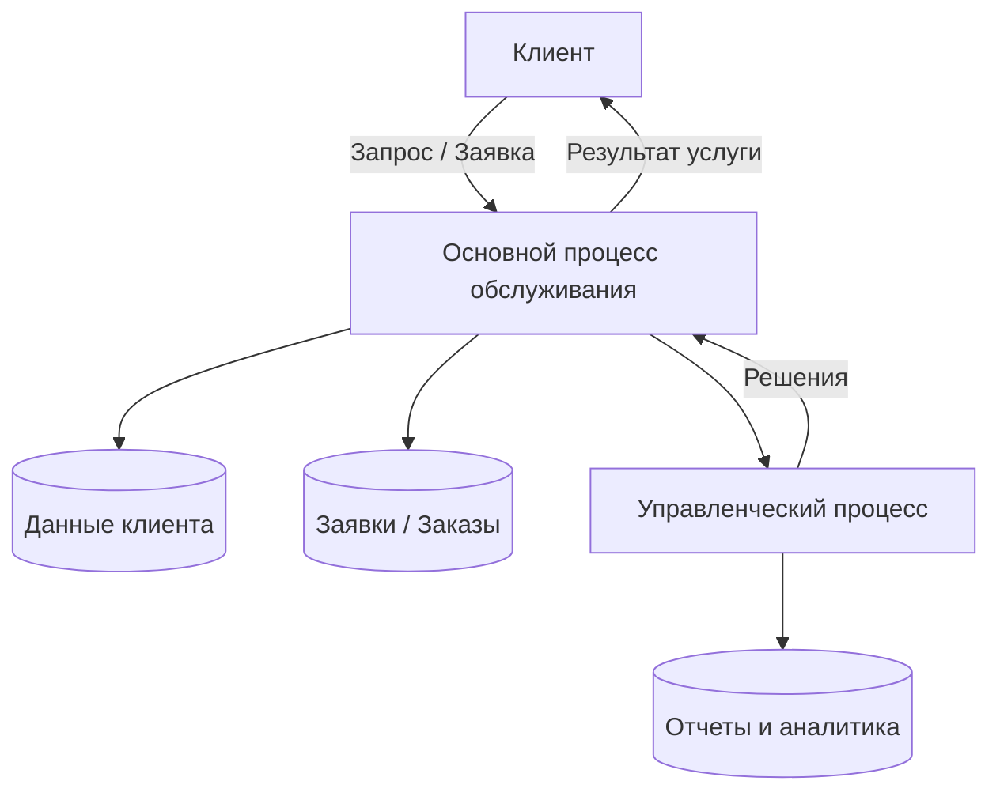
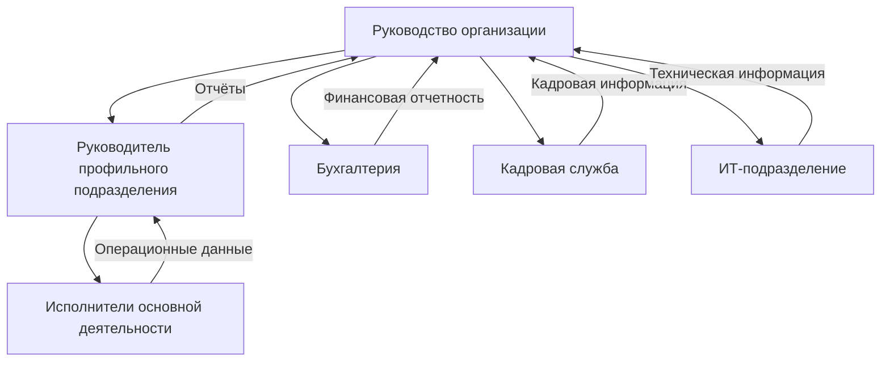

# Теория

##  Этап 1. Анализ предметной области

>Внимание! Все схемы в примере являются схематичными, требуется учитывать нотации при создании отчета.  

### 1.1. Анализ предметной области

#### 1.1.1. Общая характеристика деятельности

Общая характеристика деятельности организации представляет собой описание предметной области, в рамках которой функционирует объект исследования. Цель данного раздела — зафиксировать контекст работы организации, определить ключевые процессы, участников и информационные потоки, которые в дальнейшем подлежат анализу и автоматизации. Данный подраздел формирует основу для выявления проблем и постановки требований к разрабатываемой информационной системе.

#### 1.2.1. Сфера деятельности

Сфера деятельности определяет тип экономической или социальной активности организации. В зависимости от специфики объекта исследования организация может относиться к сфере торговли, услуг, производства, образования, государственного управления или их комбинации. Сфера деятельности влияет на структуру бизнес-процессов, требования к данным, нормативные ограничения и используемые информационные технологии. Например, для сферы услуг характерна ориентация на клиентов и учет заявок, для производства — управление ресурсами и технологическими операциями, для образования — учет контингента и образовательных программ.

#### 1.3.1. Основные направления работы

Основные направления работы отражают совокупность ключевых функций, реализуемых организацией в рамках ее деятельности. Как правило, они включают операционную деятельность (оказание услуг, производство продукции, реализация товаров), управленческую деятельность (планирование, контроль, анализ), а также вспомогательные процессы (документооборот, учет, взаимодействие с внешними контрагентами). Для целей анализа важно выделить направления, связанные с обработкой информации и принятием решений, поскольку именно они являются потенциальными объектами автоматизации.

#### 1.4.1. Масштаб деятельности

Масштаб деятельности характеризует объем и сложность функционирования организации и описывается качественно. Он может определяться численностью персонала, количеством обслуживаемых клиентов, частотой операций, территориальным охватом и интенсивностью документооборота. Масштаб напрямую влияет на требования к информационной системе, включая производительность, надежность хранения данных и необходимость распределенного доступа.

#### 1.5.1. Тип клиентов

Тип клиентов определяет характер взаимодействия организации с внешней средой. В зависимости от направленности деятельности организация может работать в сегменте B2C (физические лица), B2B (юридические лица и организации) или государственного сектора. Тип клиентов влияет на структуру данных (карточки клиентов, договоры, заявки), требования к безопасности информации и регламентам обработки персональных данных.

#### 1.6.1. Ключевые продукты и услуги

Ключевые продукты или услуги представляют собой основной результат деятельности организации, создающий ценность для клиентов. В рамках анализа предметной области важно определить, какие данные формируются и используются при оказании услуг или выпуске продукции: заказы, заявки, договоры, финансовые показатели, отчеты. Эти данные образуют информационное ядро будущей системы и используются в ключевых бизнес-процессах.

---

#### 1.7.1. Акцент на процессы и данные

С точки зрения информационного моделирования деятельность организации может быть представлена как совокупность взаимосвязанных процессов, в рамках которых происходит сбор, обработка, хранение и передача данных. Каждый процесс оперирует определенными входными данными и формирует выходные результаты, используемые в последующих этапах деятельности или для управленческих решений. Такое представление позволяет формализовать предметную область и служит основой для проектирования архитектуры информационной системы.

---

#### 1.8. Пример описания предметной области

///caption
Рисунок 1 – Схематическое описание предметной области
///

**Пояснение к рисунку 1:**

* клиент формирует запрос или заявку, которая инициирует основной процесс;
* в процессе обслуживания используются и формируются данные о клиентах и операциях;
* результаты деятельности возвращаются клиенту в виде услуги или продукта;
* управленческие процессы используют агрегированные данные для анализа и принятия решений, влияющих на основной процесс.

---

### 1.2. Анализ организационной структуры

Анализ организационной структуры направлен на изучение распределения управленческих функций, ролей и ответственности между подразделениями и должностными лицами организации. Данный анализ позволяет определить, каким образом осуществляется управление деятельностью, как принимаются решения и как организовано взаимодействие между структурными единицами. Полученные результаты используются для выявления узких мест в управлении и определения требований к информационной поддержке процессов.

#### 1.2.1. Уровни управления

В организационной структуре, как правило, выделяются несколько уровней управления:

* **стратегический уровень** — включает высшее руководство организации, ответственное за формирование целей, стратегий развития и принятие ключевых управленческих решений;
* **тактический уровень** — представлен руководителями подразделений, обеспечивающими планирование, координацию и контроль деятельности;
* **операционный уровень** — включает исполнителей, непосредственно участвующих в выполнении основных и вспомогательных процессов.

Разделение на уровни управления позволяет обеспечить иерархию принятия решений и упорядочить информационные потоки внутри организации.

#### 1.2.2. Основные подразделения

В зависимости от сферы деятельности организации в ее структуре могут быть выделены следующие типовые подразделения:

* руководство (дирекция, администрация);
* профильные подразделения, реализующие основную деятельность;
* вспомогательные службы (бухгалтерия, кадровая служба, ИТ-подразделение);
* подразделения контроля и анализа (планово-экономический отдел, служба качества).

Каждое подразделение выполняет определённый набор функций и оперирует специфическими данными, необходимыми для выполнения своих задач.

#### 1.2.3. Функции подразделений и их взаимодействие

Функции подразделений определяются их ролью в общей деятельности организации. Взаимодействие между подразделениями осуществляется посредством регламентированных процессов и обмена информацией: отчетов, заявок, служебных записок, электронных документов. Эффективность взаимодействия напрямую зависит от прозрачности распределения ответственности и доступности актуальных данных.

С точки зрения автоматизации важно зафиксировать:

* какие данные формируются в каждом подразделении;
* какие данные передаются между подразделениями;
* какие решения принимаются на основе этих данных.

---

#### 1.2.4. Роли и подразделения (обобщённое описание)

| Подразделение / роль     | Основные функции                            | Используемые и формируемые данные |
| ------------------------ | ------------------------------------------- | --------------------------------- |
| Руководство              | Стратегическое управление, принятие решений | Отчёты, аналитические данные      |
| Профильное подразделение | Выполнение основной деятельности            | Заявки, заказы, результаты работ  |
| Бухгалтерия              | Финансовый учет и отчетность                | Платежи, счета, финансовые отчёты |
| Кадровая служба          | Управление персоналом                       | Личные данные, приказы            |
| ИТ-подразделение         | Поддержка информационных систем             | Техническая документация, журналы |

---

#### 1.2.5. Схема организационной структуры

///caption
Рисунок 2 – Организационная структура организации
///

**Пояснение к рисунку 2:**

* руководство осуществляет общее управление и получает агрегированную информацию от подразделений;
* профильное подразделение выполняет основную деятельность и формирует операционные данные;
* вспомогательные подразделения обеспечивают поддержку и передают специализированные данные руководству;
* взаимодействие между уровнями управления реализуется через информационные потоки.

 