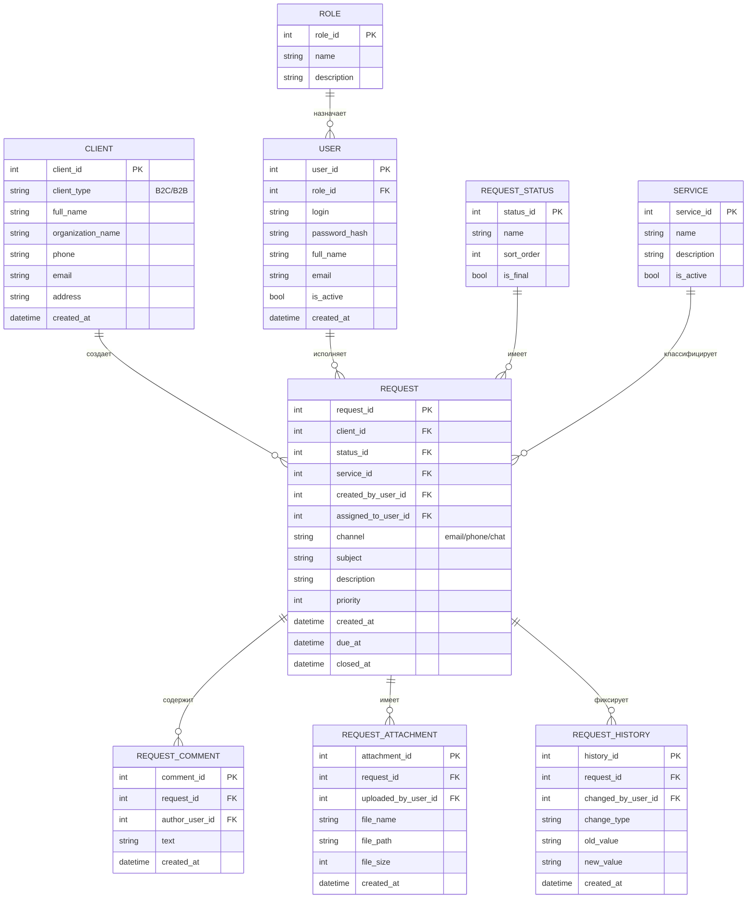
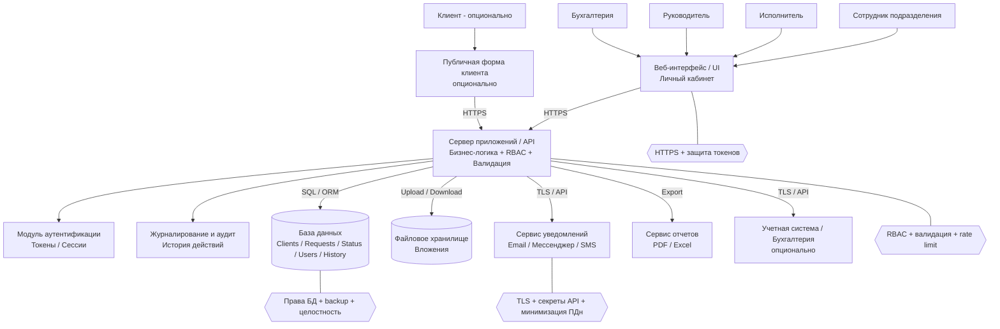
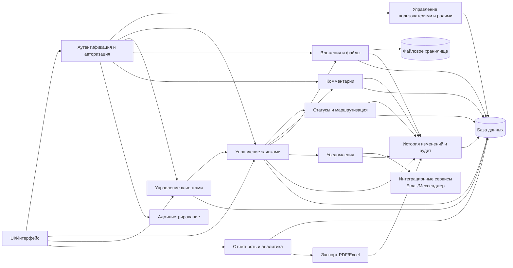

# Теория

## Этап 4. Проектирование решения

>Внимание! Все схемы в примере являются схематичными, требуется учитывать нотации при создании отчета.  

### 4.1. Выбор стратегии автоматизации

Выбор стратегии автоматизации определяет подход к созданию и внедрению информационной системы, а также влияет на сроки реализации, стоимость владения, гибкость развития и уровень рисков. В рамках данного задания рассматриваются возможные варианты автоматизации процесса обработки заявок с точки зрения их применимости к условиям деятельности организации.

---

#### 4.1.1. Собственная разработка

**Описание варианта**
Информационная система разрабатывается полностью силами организации (или привлечённой команды) с нуля, с учетом специфики процессов, требований безопасности и интеграции с существующей инфраструктурой.

**Плюсы:**

* полное соответствие бизнес-процессам организации;
* высокая гибкость при изменении требований;
* возможность поэтапного расширения функционала;
* полный контроль над архитектурой, данными и безопасностью;
* отсутствие зависимости от внешнего поставщика.

**Минусы:**

* высокая трудоёмкость разработки;
* значительные затраты времени на проектирование и реализацию;
* необходимость наличия квалифицированных специалистов;
* повышенные риски на этапе внедрения;
* ответственность за сопровождение и обновление системы.

---

#### 4.1.2. Готовое решение

**Описание варианта**
Использование существующей программной системы (например, системы учета заявок или CRM), адаптированной под задачи организации путем настройки и конфигурации.

**Плюсы:**

* сокращение сроков внедрения;
* наличие базового функционала «из коробки»;
* проверенная на практике стабильность;
* наличие технической поддержки и документации.

**Минусы:**

* ограниченные возможности адаптации под уникальные процессы;
* избыточный функционал, не используемый в организации;
* зависимость от поставщика решения;
* возможные лицензионные затраты;
* сложность доработок и интеграций.

---

#### 4.1.3. Облачный сервис

**Описание варианта**
Использование облачной платформы (SaaS), предоставляющей функционал обработки заявок через веб-интерфейс без развертывания собственной инфраструктуры.

**Плюсы:**

* минимальные затраты на инфраструктуру;
* быстрый запуск системы;
* доступ из любой точки при наличии интернета;
* автоматические обновления и резервное копирование;
* масштабируемость по количеству пользователей.

**Минусы:**

* зависимость от интернет-соединения;
* ограниченный контроль над хранением и защитой данных;
* сложности соблюдения требований информационной безопасности и законодательства;
* зависимость от внешнего провайдера;
* ограниченные возможности интеграции с внутренними системами.

---

#### 4.1.4. Комбинированный вариант

**Описание варианта**
Сочетание собственной разработки и использования готовых или облачных компонентов. Например, разработка ядра системы и базы данных внутри организации с использованием облачных сервисов для уведомлений или отчетности.

**Плюсы:**

* баланс между гибкостью и скоростью внедрения;
* возможность сохранить контроль над критичными данными;
* использование преимуществ облачных сервисов без полной зависимости от них;
* поэтапное развитие системы;
* снижение затрат на разработку отдельных компонентов.

**Минусы:**

* усложнение архитектуры;
* необходимость интеграции различных компонентов;
* повышенные требования к проектированию и сопровождению;
* потенциальные сложности в администрировании.

---

#### 4.1.5. Сравнительная таблица вариантов

| Вариант автоматизации   | Гибкость       | Срок внедрения | Контроль над данными | Стоимость владения | Риски          |
| ----------------------- | -------------- | -------------- | -------------------- | ------------------ | -------------- |
| Собственная разработка  | Высокая        | Длительный     | Полный               | Высокая            | Средние        |
| Готовое решение         | Средняя        | Короткий       | Ограниченный         | Средняя            | Низкие–средние |
| Облачный сервис         | Низкая–средняя | Очень короткий | Низкий               | Средняя            | Средние        |
| Комбинированный вариант | Высокая        | Средний        | Высокий              | Средняя            | Средние        |

---

#### 4.1.6. Выбор оптимальной стратегии

С учетом специфики процесса обработки заявок, требований к гибкости, безопасности и возможности развития системы, **оптимальным вариантом выбран комбинированный подход**.

Данный вариант позволяет:

* реализовать ключевой функционал и хранение данных внутри организации;
* обеспечить соответствие требованиям безопасности и контроля доступа;
* использовать готовые или облачные компоненты для второстепенных функций (уведомления, отчеты, интеграции);
* снизить сроки и затраты на разработку по сравнению с полностью собственной системой;
* обеспечить масштабируемость и адаптацию системы в будущем.

Выбранная стратегия автоматизации обеспечивает рациональный баланс между контролем, стоимостью, рисками и функциональной гибкостью системы.

---

### 4.2. Проектирование данных

Проектирование данных направлено на формирование логической модели хранения информации для автоматизации выбранного процесса (обработка заявок/заказов). На данном этапе определяется состав **сущностей**, **их атрибуты**, **связи**, а также выполняется нормализация структуры данных до **третьей нормальной формы (3НФ)**, что позволяет снизить дублирование, обеспечить целостность и упростить дальнейшее сопровождение системы.

---

#### 4.2.1. Сущности и связи

Для автоматизации процесса обработки заявок выделяются следующие базовые сущности:

* **Пользователь** — сотрудник системы (с разными ролями).
* **Роль** — набор прав доступа.
* **Клиент** — инициатор заявки (контрагент/физлицо/организация).
* **Заявка** — основной объект процесса (регистрация, статус, сроки, исполнитель).
* **Статус заявки** — справочник состояний заявки.
* **Комментарий** — коммуникация и фиксация уточнений по заявке.
* **Вложение** — файлы, прикрепляемые к заявке (акты, сканы, переписка).
* **История изменений** — аудит действий и изменений статуса/полей.
* **Услуга** (опционально) — справочник услуг/работ, если требуется классификация.
* **Уведомление** (опционально) — фиксация отправки сообщений клиенту.

Ключевые связи:

* Роль **1 → N** Пользователь
* Клиент **1 → N** Заявка
* Пользователь (исполнитель) **1 → N** Заявка
* Статус **1 → N** Заявка
* Заявка **1 → N** Комментарий
* Заявка **1 → N** Вложение
* Заявка **1 → N** История изменений
* Услуга **1 → N** Заявка (если услуга используется)

---

#### 4.2.2. ER-диаграмма (Mermaid)

///caption
Рисунок 7 – ER-диаграмма
///

---

#### 4.2.3. Нормализация до 3НФ

Нормализация выполняется для исключения избыточности и обеспечения корректности связей.

##### 1НФ (первая нормальная форма)

* Все таблицы имеют **первичный ключ**.
* Все поля атомарны: нет повторяющихся групп и списков в одном поле (например, комментарии и вложения вынесены в отдельные таблицы).

##### 2НФ (вторая нормальная форма)

* Нет частичных зависимостей от составного ключа (составные ключи не используются в основной модели; зависимые сущности вынесены отдельно).

##### 3НФ (третья нормальная форма)

* Исключены транзитивные зависимости:

  * данные роли не хранятся в USER, а вынесены в ROLE;
  * статус заявки не хранится строкой в REQUEST, а вынесен в REQUEST_STATUS;
  * справочные сведения об услуге вынесены в SERVICE;
  * история изменений, комментарии и вложения вынесены в отдельные сущности, чтобы не дублировать данные в REQUEST.

Результат: каждая неключевая колонка зависит **только от ключа**, **всего ключа** и **ничего кроме ключа**.

---

#### 4.2.4. Описание структуры таблиц

Ниже представлена спецификация таблиц в формате, пригодном для последующего DDL-проектирования.

##### Таблица ROLE

| Таблица | Поле        | Тип          | Ключ | Назначение         |
| ------- | ----------- | ------------ | ---- | ------------------ |
| ROLE    | role_id     | INT          | PK   | Идентификатор роли |
| ROLE    | name        | VARCHAR(50)  |      | Наименование роли  |
| ROLE    | description | VARCHAR(255) |      | Описание роли      |

##### Таблица USER

| Таблица | Поле          | Тип          | Ключ              | Назначение                 |
| ------- | ------------- | ------------ | ----------------- | -------------------------- |
| USER    | user_id       | INT          | PK                | Идентификатор пользователя |
| USER    | role_id       | INT          | FK → ROLE.role_id | Роль пользователя          |
| USER    | login         | VARCHAR(50)  | UQ                | Логин для входа            |
| USER    | password_hash | VARCHAR(255) |                   | Хэш пароля                 |
| USER    | full_name     | VARCHAR(150) |                   | ФИО                        |
| USER    | email         | VARCHAR(120) |                   | Email                      |
| USER    | is_active     | BOOLEAN      |                   | Активность учетной записи  |
| USER    | created_at    | TIMESTAMP    |                   | Дата создания              |

##### Таблица CLIENT

| Таблица | Поле              | Тип          | Ключ | Назначение            |
| ------- | ----------------- | ------------ | ---- | --------------------- |
| CLIENT  | client_id         | INT          | PK   | Идентификатор клиента |
| CLIENT  | client_type       | VARCHAR(10)  |      | Тип (B2C/B2B)         |
| CLIENT  | full_name         | VARCHAR(150) |      | ФИО клиента (для B2C) |
| CLIENT  | organization_name | VARCHAR(200) |      | Организация (для B2B) |
| CLIENT  | phone             | VARCHAR(30)  |      | Телефон               |
| CLIENT  | email             | VARCHAR(120) |      | Email                 |
| CLIENT  | address           | VARCHAR(255) |      | Адрес                 |
| CLIENT  | created_at        | TIMESTAMP    |      | Дата добавления       |

##### Таблица REQUEST_STATUS

| Таблица        | Поле       | Тип         | Ключ | Назначение                 |
| -------------- | ---------- | ----------- | ---- | -------------------------- |
| REQUEST_STATUS | status_id  | INT         | PK   | Идентификатор статуса      |
| REQUEST_STATUS | name       | VARCHAR(50) | UQ   | Наименование статуса       |
| REQUEST_STATUS | sort_order | INT         |      | Порядок отображения        |
| REQUEST_STATUS | is_final   | BOOLEAN     |      | Признак финального статуса |

##### Таблица SERVICE (опционально)

| Таблица | Поле        | Тип          | Ключ | Назначение           |
| ------- | ----------- | ------------ | ---- | -------------------- |
| SERVICE | service_id  | INT          | PK   | Идентификатор услуги |
| SERVICE | name        | VARCHAR(150) |      | Наименование услуги  |
| SERVICE | description | VARCHAR(255) |      | Описание             |
| SERVICE | is_active   | BOOLEAN      |      | Активность           |

##### Таблица REQUEST

| Таблица | Поле                | Тип          | Ключ                          | Назначение                 |
| ------- | ------------------- | ------------ | ----------------------------- | -------------------------- |
| REQUEST | request_id          | INT          | PK                            | Идентификатор заявки       |
| REQUEST | client_id           | INT          | FK → CLIENT.client_id         | Клиент                     |
| REQUEST | status_id           | INT          | FK → REQUEST_STATUS.status_id | Текущий статус             |
| REQUEST | service_id          | INT          | FK → SERVICE.service_id       | Услуга (если используется) |
| REQUEST | created_by_user_id  | INT          | FK → USER.user_id             | Кто зарегистрировал        |
| REQUEST | assigned_to_user_id | INT          | FK → USER.user_id             | Исполнитель                |
| REQUEST | channel             | VARCHAR(20)  |                               | Канал поступления          |
| REQUEST | subject             | VARCHAR(200) |                               | Тема/краткое описание      |
| REQUEST | description         | TEXT         |                               | Подробности заявки         |
| REQUEST | priority            | INT          |                               | Приоритет (например, 1–5)  |
| REQUEST | created_at          | TIMESTAMP    |                               | Дата создания              |
| REQUEST | due_at              | TIMESTAMP    |                               | Срок исполнения            |
| REQUEST | closed_at           | TIMESTAMP    |                               | Дата закрытия              |

##### Таблица REQUEST_COMMENT

| Таблица         | Поле           | Тип       | Ключ                    | Назначение                |
| --------------- | -------------- | --------- | ----------------------- | ------------------------- |
| REQUEST_COMMENT | comment_id     | INT       | PK                      | Идентификатор комментария |
| REQUEST_COMMENT | request_id     | INT       | FK → REQUEST.request_id | Заявка                    |
| REQUEST_COMMENT | author_user_id | INT       | FK → USER.user_id       | Автор                     |
| REQUEST_COMMENT | text           | TEXT      |                         | Текст комментария         |
| REQUEST_COMMENT | created_at     | TIMESTAMP |                         | Дата создания             |

##### Таблица REQUEST_ATTACHMENT

| Таблица            | Поле                | Тип          | Ключ                    | Назначение              |
| ------------------ | ------------------- | ------------ | ----------------------- | ----------------------- |
| REQUEST_ATTACHMENT | attachment_id       | INT          | PK                      | Идентификатор вложения  |
| REQUEST_ATTACHMENT | request_id          | INT          | FK → REQUEST.request_id | Заявка                  |
| REQUEST_ATTACHMENT | uploaded_by_user_id | INT          | FK → USER.user_id       | Кто загрузил            |
| REQUEST_ATTACHMENT | file_name           | VARCHAR(255) |                         | Имя файла               |
| REQUEST_ATTACHMENT | file_path           | VARCHAR(500) |                         | Путь/ссылка на хранение |
| REQUEST_ATTACHMENT | file_size           | INT          |                         | Размер файла (байт)     |
| REQUEST_ATTACHMENT | created_at          | TIMESTAMP    |                         | Дата загрузки           |

##### Таблица REQUEST_HISTORY

| Таблица         | Поле               | Тип         | Ключ                    | Назначение                         |
| --------------- | ------------------ | ----------- | ----------------------- | ---------------------------------- |
| REQUEST_HISTORY | history_id         | INT         | PK                      | Идентификатор записи истории       |
| REQUEST_HISTORY | request_id         | INT         | FK → REQUEST.request_id | Заявка                             |
| REQUEST_HISTORY | changed_by_user_id | INT         | FK → USER.user_id       | Кто изменил                        |
| REQUEST_HISTORY | change_type        | VARCHAR(50) |                         | Тип изменения (STATUS/ASSIGN/etc.) |
| REQUEST_HISTORY | old_value          | TEXT        |                         | Предыдущее значение                |
| REQUEST_HISTORY | new_value          | TEXT        |                         | Новое значение                     |
| REQUEST_HISTORY | created_at         | TIMESTAMP   |                         | Дата изменения                     |

### 4.3. Проектирование архитектуры системы

Проектирование архитектуры системы направлено на определение структуры автоматизированного решения, состава компонентов и их взаимодействия. Архитектура должна обеспечивать реализацию функциональных требований (учёт заявок, роли, статусы, отчётность) и нефункциональных требований (производительность, надёжность, безопасность, совместимость), а также предусматривать масштабирование и интеграции.

---

#### 4.3.1. Уровни системы

Архитектура системы целесообразно представляется в виде многоуровневой модели:

1. **Уровень представления (Интерфейс / UI)**

   * веб-интерфейс для сотрудников (сотрудник подразделения, исполнитель, руководитель, бухгалтерия);
   * (опционально) публичная форма для клиента: создание заявки/проверка статуса.

2. **Прикладной уровень (Сервер приложений / API)**

   * бизнес-логика процесса обработки заявок;
   * управление ролями, статусами, сроками;
   * формирование отчетов;
   * аудит событий и журналирование.

3. **Уровень данных (База данных)**

   * хранение сущностей (клиенты, заявки, статусы, пользователи, история, вложения);
   * обеспечение целостности (PK/FK, ограничения, транзакции);
   * резервное копирование и восстановление.

4. **Уровень интеграций**

   * уведомления (email/мессенджер/смс — по выбранному каналу);
   * экспорт отчетов (PDF/Excel);
   * (опционально) интеграция с бухгалтерией/учетной системой;
   * (опционально) файловое хранилище для вложений.

---

#### 4.3.2. Взаимодействие компонентов

Основной принцип взаимодействия — клиентский интерфейс обращается к серверу приложений через API, сервер реализует бизнес-логику и работает с БД, а также вызывает внешние сервисы при необходимости (уведомления, экспорт, интеграции).

**Типовой сценарий: регистрация и обработка заявки**

1. Пользователь проходит аутентификацию через UI.
2. UI отправляет запрос на API (создание/редактирование заявки).
3. API проверяет права доступа (роль), валидирует входные данные и сохраняет изменения в БД.
4. API создает запись в истории изменений (аудит) и при необходимости инициирует отправку уведомления.
5. UI получает подтверждение и отображает актуальный статус/данные.

---

#### 4.3.3. Точки безопасности

Точки безопасности фиксируются на каждом уровне:

##### Интерфейс (UI)

* доступ только по защищенному протоколу (HTTPS);
* защита сессий/токенов (хранение, время жизни, обновление);
* защита от типовых веб-угроз (XSS/CSRF) при веб-доступе;
* ограничение функционала по роли (скрытие/блокировка действий на уровне UI как дополнительная мера).

##### Сервер приложений (API)

* **аутентификация** (логин/пароль, токены);
* **авторизация** (RBAC — управление доступом по ролям);
* валидация входных данных;
* журналирование критичных действий (вход, изменение прав, смена статуса, удаление);
* контроль частоты запросов (rate limiting) при необходимости.

##### База данных

* разграничение прав доступа к БД (учётные записи, минимальные привилегии);
* контроль целостности (ограничения, внешние ключи);
* резервное копирование и контроль восстановления;
* (опционально) шифрование на уровне диска/хранилища.

##### Интеграции и обмен данными

* защищённые каналы взаимодействия (TLS);
* хранение ключей/API-токенов в защищённом хранилище конфигурации;
* логирование фактов отправки уведомлений/экспортов;
* минимизация передачи персональных данных во внешние сервисы.

---

#### 4.3.4. Архитектурная схема системы (Mermaid)

///caption
Рисунок 8 – Архитектурная схема системы 
///

### 4.4. Проектирование модулей системы

Проектирование модулей системы направлено на декомпозицию решения на логически завершённые программные компоненты. Каждый модуль должен иметь определённое назначение, набор функций, входные и выходные данные, а также связи с другими модулями. Такая декомпозиция обеспечивает управляемость разработки, тестирования и сопровождения системы, а также позволяет сопоставить модули с функциональными требованиями и моделью данных.

---

#### 4.4.1. Перечень программных модулей

В рамках архитектуры (UI → API → БД + интеграции) целесообразно выделить следующие модули:

1. Модуль аутентификации и авторизации (RBAC)
2. Модуль управления пользователями и ролями
3. Модуль управления клиентами
4. Модуль управления заявками
5. Модуль статусов и маршрутизации заявок
6. Модуль комментариев и коммуникаций
7. Модуль вложений и файлового хранилища
8. Модуль истории изменений и аудита
9. Модуль отчетности и аналитики
10. Модуль уведомлений и оповещений (интеграционный)
11. Модуль администрирования и настроек
12. Модуль интеграций с внешними системами (опционально)

---

#### 4.4.2. Описание модулей (назначение, вход/выход, связи)

| Модуль                              | Назначение                                                                          | Входные данные                                                  | Выходные данные                                  | Связи                                                                         |
| ----------------------------------- | ----------------------------------------------------------------------------------- | --------------------------------------------------------------- | ------------------------------------------------ | ----------------------------------------------------------------------------- |
| Аутентификация и авторизация (RBAC) | Идентификация пользователя, выдача токена/сессии, проверка прав доступа             | Логин, пароль; токен; роль                                      | Токен доступа; результат проверки прав           | UI, Управление пользователями, Все бизнес-модули                              |
| Управление пользователями и ролями  | Создание/изменение пользователей, назначение ролей, блокировка                      | Данные пользователя; роль; параметры доступа                    | Карточка пользователя; назначенные права         | RBAC, БД, Аудит                                                               |
| Управление клиентами                | Создание и актуализация карточек клиентов, поиск, привязка к заявкам                | Данные клиента (ФИО/организация, контакты)                      | Карточка клиента; список клиентов                | Управление заявками, БД, Аудит                                                |
| Управление заявками                 | Регистрация, просмотр, изменение, назначение исполнителя, закрытие заявки           | Данные заявки (клиент, тема, описание, канал, приоритет, сроки) | Заявка с ID; обновлённые атрибуты; списки заявок | Статусы/Маршрутизация, Клиенты, Вложения, Комментарии, Аудит, БД, Уведомления |
| Статусы и маршрутизация             | Управление справочником статусов, изменение статуса по правилам, контроль переходов | Текущий статус; целевой статус; роль; правила                   | Новый статус; отметки просрочки/ограничения      | Управление заявками, Аудит, Отчетность                                        |
| Комментарии и коммуникации          | Добавление комментариев, фиксация уточнений, внутреннее обсуждение                  | Текст комментария; автор; ID заявки                             | Комментарий; лента комментариев                  | Управление заявками, Аудит, БД                                                |
| Вложения и файлы                    | Загрузка/скачивание файлов, привязка вложений к заявке, контроль доступа            | Файл; метаданные; ID заявки                                     | Запись вложения; путь хранения                   | Управление заявками, Файловое хранилище, RBAC, Аудит                          |
| История изменений и аудит           | Фиксация действий (кто/когда/что), хранение истории статусов и правок               | События изменений; тип операции; old/new                        | Записи истории и журнал событий                  | Все модули, БД, Отчетность                                                    |
| Отчетность и аналитика              | Формирование управленческих отчётов, KPI, выгрузка PDF/Excel                        | Период; фильтры; источники данных                               | Отчёты; файлы экспорта; метрики                  | БД, Экспорт, Аудит, UI                                                        |
| Уведомления (интеграционный)        | Отправка уведомлений клиенту/сотрудникам о статусах и событиях                      | Событие; шаблон; адресат; канал                                 | Статус доставки; запись уведомления              | Управление заявками, Интеграции, Аудит                                        |
| Администрирование и настройки       | Настройка справочников, регламентов, каналов уведомлений, параметров SLA            | Параметры системы; справочники; правила                         | Актуальные настройки                             | RBAC, Все модули                                                              |
| Интеграции (опционально)            | Обмен с учетной системой/CRM/EDI, импорт/экспорт данных                             | Пакеты данных; API-токены; расписание                           | Результат обмена; логи                           | Уведомления, Отчетность, Аудит                                                |

---

#### 4.4.3. Взаимодействие модулей (Mermaid)

///caption
Рисунок 9 – Взаимодействие модулей
///

---

#### 4.4.4. Примечание по трассировке требований

* Модули **Управление заявками**, **Статусы**, **Клиенты**, **Отчетность**, **Уведомления**, **Аудит** напрямую покрывают функциональные требования (Задание 10).
* Модули **RBAC**, **Аудит**, **Администрирование**, **Интеграции** обеспечивают выполнение нефункциональных требований (Задание 11), особенно по безопасности, надёжности и совместимости.
 