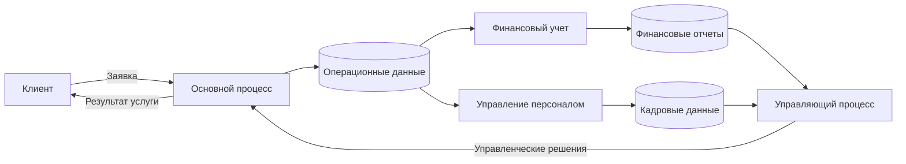
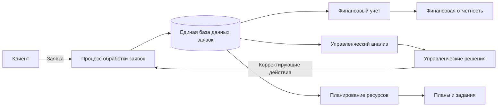
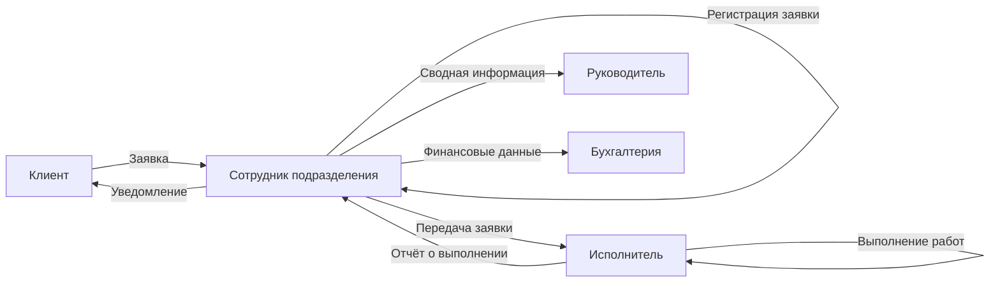
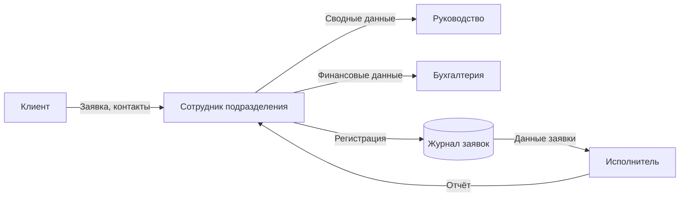

# Теория

## Этап 2. Анализ процессов и выбор автоматизации

### 2.1. Описание ключевых процессов

Описание ключевых процессов направлено на выявление и структурирование деятельности организации в виде совокупности взаимосвязанных процессов. Процессный подход позволяет рассматривать деятельность не как набор разрозненных функций, а как систему преобразования входных данных в результаты, создающие ценность для клиентов и обеспечивающие достижение целей организации. Данный анализ необходим для определения приоритетных объектов автоматизации и оптимизации.

#### 2.1.1. Классификация процессов

В рамках анализа выделяются три основные группы процессов:

* **основные процессы** — непосредственно направлены на создание продукта или оказание услуги и формируют основную ценность для клиента;
* **вспомогательные процессы** — обеспечивают выполнение основных процессов ресурсами, информацией и инфраструктурой;
* **управляющие процессы** — связаны с планированием, контролем, анализом и принятием управленческих решений.

Такое разделение позволяет определить роль каждого процесса в деятельности организации и оценить его вклад в достижение результатов.

---

#### 2.1.2. Характеристика ключевых процессов

| Процесс                    | Тип процесса    | Входы                                   | Выходы                               | Ответственные            | Значимость     |
| -------------------------- | --------------- | --------------------------------------- | ------------------------------------ | ------------------------ | -------------- |
| Обработка заявок / заказов | Основной        | Запрос клиента, данные клиента          | Оказанная услуга / выполненный заказ | Профильное подразделение | Высокая        |
| Формирование отчетности    | Управляющий     | Операционные и финансовые данные        | Управленческие отчёты                | Руководство, бухгалтерия | Высокая        |
| Финансовый учет            | Вспомогательный | Первичные документы, данные операций    | Финансовые отчёты, платежи           | Бухгалтерия              | Средняя        |
| Управление персоналом      | Вспомогательный | Данные сотрудников, приказы             | Кадровые документы                   | Кадровая служба          | Средняя        |
| ИТ-поддержка               | Вспомогательный | Запросы пользователей, системные данные | Работоспособность ИС                 | ИТ-подразделение         | Низкая–средняя |

**Примечание:**
Значимость процессов определяется с точки зрения влияния на конечный результат деятельности и устойчивость функционирования организации.

---

#### 2.1.3. Взаимосвязь ключевых процессов (Mermaid)

///caption
Рисунок 3 – Взаимосвязь ключевых процессов деятельности
///

**Пояснение к рисунку 3:**

* основной процесс инициируется клиентом и формирует ключевые операционные данные;
* вспомогательные процессы используют операционные данные для учета и обеспечения;
* управляющий процесс агрегирует информацию и формирует решения;
* управленческие решения воздействуют на основной процесс, замыкая цикл управления.

---

### 2.2. Выбор процесса для автоматизации

Выбор процесса для автоматизации является ключевым этапом аналитической части выпускной квалификационной работы, поскольку от корректности данного выбора зависит эффективность разрабатываемой информационной системы. Для автоматизации целесообразно выбирать процесс, который оказывает существенное влияние на результаты деятельности организации, характеризуется высокой трудоёмкостью и связан с обработкой значительных объёмов данных.

#### 2.2.1. Обоснование выбора процесса

В качестве процесса, подлежащего автоматизации, выбран **процесс обработки заявок (заказов) клиентов**. Данный процесс относится к основным процессам деятельности организации и непосредственно связан с оказанием услуг (выполнением работ) и взаимодействием с клиентами. Он инициируется внешними запросами и формирует первичные данные, которые в дальнейшем используются во вспомогательных и управляющих процессах.

Процесс обработки заявок является сквозным и затрагивает несколько подразделений, что делает его критически важным для устойчивого функционирования организации и качества предоставляемых услуг.

---

#### 2.2.2. Критерии выбора процесса

Выбор процесса для автоматизации обоснован следующими критериями:

* **Высокая трудоёмкость**
  Процесс включает ручной ввод данных, регистрацию заявок, контроль статусов и подготовку отчетной информации, что требует значительных затрат рабочего времени сотрудников.

* **Вероятность ошибок**
  Ручная обработка заявок повышает риск допущения ошибок при вводе данных, потере информации и несогласованности сведений между подразделениями.

* **Большие объёмы данных**
  В рамках процесса обрабатываются данные о клиентах, заявках, сроках исполнения, результатах и связанных документах, объём которых увеличивается по мере роста деятельности организации.

* **Существенное влияние на результат деятельности**
  Качество и скорость обработки заявок напрямую влияют на удовлетворённость клиентов, репутацию организации и эффективность использования ресурсов.

---

#### 2.2.3. Цели автоматизации процесса

Целями автоматизации процесса обработки заявок являются:

* сокращение времени обработки заявок за счёт автоматизации регистрации и маршрутизации;
* снижение количества ошибок, связанных с ручным вводом и дублированием данных;
* обеспечение централизованного хранения и актуальности информации;
* повышение прозрачности процесса за счёт контроля статусов и сроков выполнения;
* формирование аналитической и управленческой отчётности в автоматическом режиме.

Достижение указанных целей позволит повысить эффективность как основного процесса, так и связанных с ним вспомогательных и управляющих процессов.

---

#### 2.2.4. Место процесса в общей системе деятельности

Процесс обработки заявок занимает центральное место в системе деятельности организации, так как он связывает внешнюю среду (клиентов) с внутренними подразделениями и является источником первичных данных для других процессов. Результаты данного процесса используются:

* бухгалтерией — для финансового учета и расчетов;
* руководством — для анализа показателей и принятия управленческих решений;
* вспомогательными подразделениями — для планирования ресурсов и обеспечения деятельности.

Автоматизация данного процесса способствует повышению эффективности всей системы управления деятельностью организации.

---

#### 2.2.5. Место процесса в системе (Mermaid)

///caption
Рисунок 4 – Место процесса обработки заявок в системе деятельности организации
///

**Пояснение к рисунку 4:**

* процесс обработки заявок является источником первичных данных;
* данные используются во вспомогательных и управляющих процессах;
* управленческие решения формируют обратную связь и влияют на выполнение процесса.

---

### 2.3. Описание текущего выполнения процесса

#### 2.3.1. Общая характеристика процесса (AS-IS)

Процесс обработки заявок клиентов относится к основным процессам деятельности организации и реализуется с использованием разрозненных инструментов (электронная почта, таблицы, бумажные документы). Отсутствие единой информационной системы приводит к фрагментации данных и повышенной нагрузке на персонал.

---

#### 2.3.2. Последовательность шагов процесса

Текущее выполнение процесса включает следующие этапы:

1. Клиент направляет заявку по электронной почте, телефону или через мессенджер.
2. Сотрудник профильного подразделения принимает заявку и вручную фиксирует её в журнале или таблице.
3. Производится проверка корректности и полноты данных заявки.
4. Заявка передается ответственному исполнителю.
5. Исполнитель выполняет работы / оказывает услугу.
6. Результаты выполнения фиксируются в отчетных документах.
7. Информация о выполнении заявки передается руководству и, при необходимости, в бухгалтерию.
8. Клиент уведомляется о завершении обработки заявки.

---

#### 2.3.3. Участники процесса и роли

| Участник                            | Роль в процессе                               |
| ----------------------------------- | --------------------------------------------- |
| Клиент                              | Инициатор процесса, источник исходных данных  |
| Сотрудник профильного подразделения | Приём и регистрация заявки                    |
| Исполнитель                         | Непосредственное выполнение работ             |
| Руководитель подразделения          | Контроль сроков и качества выполнения         |
| Бухгалтерия                         | Финансовый учет и расчеты (при необходимости) |

---

#### 2.3.4. Документы и данные процесса

В рамках текущего выполнения процесса используются следующие документы и данные:

* заявка клиента (письмо, сообщение, устное обращение);
* журнал регистрации заявок (Excel / бумажный носитель);
* карточка клиента;
* отчёт о выполнении заявки;
* финансовые документы (счета, акты).

Данные хранятся в разрозненных источниках, не всегда синхронизированных между собой.

---

#### 2.3.5. Проблемы и узкие места процесса

Анализ текущего выполнения процесса позволил выявить следующие проблемы:

* **дублирование ввода данных** в различных документах и таблицах;
* **высокая вероятность ошибок** при ручной регистрации заявок;
* **отсутствие прозрачности статусов** выполнения заявок;
* **затруднённый контроль сроков** исполнения;
* **разрозненное хранение данных**, усложняющее формирование отчетности;
* зависимость процесса от человеческого фактора.

Указанные узкие места обуславливают необходимость автоматизации процесса.

---

#### 2.3.6. Модель текущего процесса (BPMN, AS-IS)

///caption
Рисунок 5 – Модель текущего выполнения процесса обработки заявок (AS-IS)
///

**Пояснение к рисунку 5:**

* процесс инициируется клиентом;
* регистрация и контроль выполняются вручную сотрудником подразделения;
* данные передаются между участниками без единой информационной среды;
* контроль и учет выполняются постфактум.

---

### 2.4. Анализ информационных потоков процесса

Анализ информационных потоков направлен на выявление источников и получателей данных, характеристик передаваемой информации, а также проблем, возникающих при её обработке и передаче. Данный анализ позволяет оценить степень формализованности процесса и определить потенциал его автоматизации.

#### 2.4.1. Источники и получатели данных

В рамках текущего выполнения процесса обработки заявок формируются и используются следующие информационные потоки:

* **внешние источники данных** — клиенты, инициирующие процесс;
* **внутренние источники данных** — сотрудники и подразделения, участвующие в обработке заявок;
* **получатели данных** — подразделения, использующие информацию для выполнения своих функций и принятия решений.

---

#### 2.4.2. Характеристика информационных потоков

| Источник данных         | Получатель данных       | Тип данных                | Формат хранения / передачи | Проблемы и риски               | Возможности автоматизации     |
| ----------------------- | ----------------------- | ------------------------- | -------------------------- | ------------------------------ | ----------------------------- |
| Клиент                  | Сотрудник подразделения | Заявка, контактные данные | Email, мессенджер, устно   | Потеря заявок, неполные данные | Веб-форма, единый канал ввода |
| Сотрудник подразделения | Журнал заявок           | Регистрационные данные    | Excel, бумажный журнал     | Дублирование, ошибки ввода     | Централизованная БД           |
| Журнал заявок           | Исполнитель             | Данные заявки             | Таблица, устная передача   | Неактуальные статусы           | Автоматическая маршрутизация  |
| Исполнитель             | Сотрудник подразделения | Отчёт о выполнении        | Текстовый файл, устно      | Несвоевременная фиксация       | Электронные отчёты в системе  |
| Сотрудник подразделения | Руководство             | Сводные данные            | Excel, PDF                 | Трудоёмкость подготовки        | Автоматическая отчетность     |
| Сотрудник подразделения | Бухгалтерия             | Финансовые данные         | Email, документы           | Несогласованность данных       | Интеграция с учётной системой |

---

#### 2.4.3. Типы данных процесса

В процессе обработки заявок используются следующие основные типы данных:

* **справочные данные** — информация о клиентах, исполнителях, услугах;
* **операционные данные** — заявки, статусы выполнения, сроки;
* **отчётные данные** — сводные таблицы, аналитические показатели;
* **финансовые данные** — суммы, счета, акты выполненных работ.

Разнородность типов данных усложняет их согласованное использование без автоматизированной поддержки.

---

#### 2.4.4. Форматы хранения и передачи данных

В текущем состоянии используются разрозненные форматы хранения и передачи информации:

* электронная почта и мессенджеры;
* таблицы Excel;
* текстовые документы;
* бумажные носители.

Отсутствие единого формата и централизованного хранилища приводит к несогласованности данных и затрудняет контроль их актуальности.

---

#### 2.4.5. Проблемы и риски информационных потоков

В результате анализа выявлены следующие проблемы и риски:

* отсутствие единого источника достоверных данных;
* высокая вероятность потери или искажения информации;
* дублирование данных в различных источниках;
* низкая оперативность получения информации;
* сложность формирования аналитической и управленческой отчетности;
* зависимость от человеческого фактора.

---

#### 2.4.6. Возможности автоматизации информационных потоков

Автоматизация процесса обработки заявок позволяет:

* централизовать ввод и хранение данных в единой базе;
* стандартизировать форматы данных и документы;
* обеспечить автоматическую передачу информации между участниками процесса;
* снизить количество ошибок и дублирующих операций;
* реализовать контроль статусов и сроков выполнения;
* обеспечить формирование отчетности в реальном времени.

---

#### 2.4.7. Схема информационных потоков (AS-IS, Mermaid)

///caption
Рисунок 6 – Схема информационных потоков процесса обработки заявок (AS-IS)
///

**Пояснение к рисунку 6:**

* информационные потоки распределены между несколькими участниками;
* данные передаются в различных форматах и каналах;
* отсутствует единое централизованное хранилище данных.

---

### 2.5. Определение требований безопасности

Цель определения требований безопасности — установить меры защиты информации, обрабатываемой в рамках автоматизируемого процесса, с учётом её ценности, критичности и возможных угроз. Требования безопасности направлены на обеспечение конфиденциальности, целостности и доступности данных, а также на снижение рисков несанкционированного доступа и искажения информации.

#### 2.5.1. Категории информации

В процессе обработки заявок используются различные категории информации, отличающиеся по уровню критичности и требованиям к защите:

| Категория информации      | Описание                                      | Уровень критичности |
| ------------------------- | --------------------------------------------- | ------------------- |
| Персональные данные       | ФИО, контактные данные клиентов и сотрудников | Высокий             |
| Операционные данные       | Заявки, статусы, сроки выполнения             | Высокий             |
| Финансовые данные         | Счета, суммы, акты                            | Высокий             |
| Управленческая информация | Отчёты, аналитические показатели              | Средний             |
| Справочная информация     | Перечни услуг, регламенты                     | Низкий              |

---

#### 2.5.2. Возможные угрозы безопасности

При анализе текущего состояния процесса выявлены следующие потенциальные угрозы:

* несанкционированный доступ к персональным и финансовым данным;
* утечка информации при передаче данных по незащищённым каналам;
* искажение или удаление данных вследствие ошибок пользователей;
* потеря данных при сбоях оборудования или программного обеспечения;
* отсутствие фиксации действий пользователей и невозможность аудита.

---

#### 2.5.3. Требования к доступу к информации

Для обеспечения разграничения прав доступа в информационной системе должны быть реализованы следующие требования:

* доступ к данным предоставляется **на основе ролей пользователей** (руководитель, сотрудник, исполнитель, бухгалтер и др.);
* каждому пользователю назначается минимально необходимый уровень прав (принцип минимальных привилегий);
* доступ к персональным и финансовым данным ограничивается уполномоченными лицами;
* обязательная аутентификация пользователей при входе в систему;
* запрет несанкционированного изменения и удаления данных.

---

#### 2.5.4. Требования к хранению и передаче данных

В целях защиты информации при хранении и передаче должны быть выполнены следующие требования:

* централизованное хранение данных в единой базе данных;
* защита базы данных от незащищённого доступа;
* резервное копирование данных на регулярной основе;
* использование защищённых каналов передачи данных;
* исключение передачи критичной информации в открытом виде (по незащищённой электронной почте, мессенджерам).

---

#### 2.5.5. Требования к контролю и журналированию

Для обеспечения контроля действий пользователей и последующего анализа инцидентов информационной безопасности система должна обеспечивать:

* ведение журналов регистрации входа пользователей в систему;
* фиксацию операций создания, изменения и удаления данных;
* хранение журналов в защищённом виде;
* возможность анализа журналов ответственными лицами;
* выявление несанкционированных и аномальных действий.

---

#### 2.5.6. Сводная таблица требований безопасности

| Объект защиты         | Угрозы                             | Требования безопасности              |
| --------------------- | ---------------------------------- | ------------------------------------ |
| Персональные данные   | Утечка, несанкционированный доступ | Ролевой доступ, защищённое хранение  |
| Операционные данные   | Искажение, удаление                | Контроль прав, резервное копирование |
| Финансовые данные     | Подмена, утрата                    | Ограниченный доступ, журналирование  |
| Управленческие отчёты | Несанкционированное изменение      | Контроль доступа, аудит действий     |

